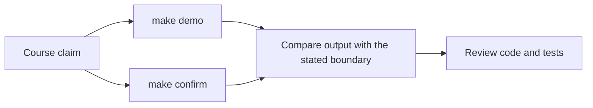
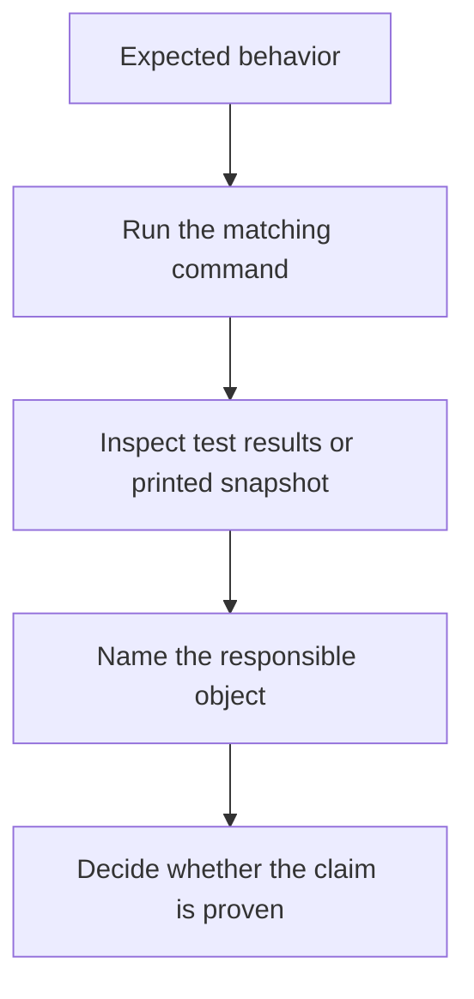

# Proof Guide

<!-- page-maps:start -->
## Guide Maps

<!-- page-maps:end -->

This capstone should not be trusted because the prose sounds tidy. It should be trusted
because the learner can inspect behavior directly.

## Current proof routes

- `make confirm` runs the executable test suite.
- `make demo` runs the human-readable monitoring scenario.

## What each route proves

- `make confirm` proves that the current object boundaries and lifecycle behavior survive executable checks.
- `make demo` proves that a human can follow the scenario from policy creation to incident publication and resulting snapshots.

## Honest limitation

These routes prove different things. Tests prove behavioral contracts precisely. The demo
proves that the system remains understandable as a story. You need both.

## Best review pattern

1. State the claim you want to check.
2. Choose the command that produces the closest evidence.
3. Inspect the relevant code file.
4. Decide whether the evidence matches the design claim or only hints at it.
