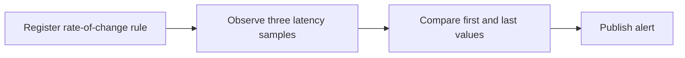
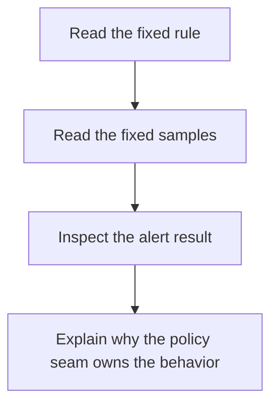

# Rate Of Change Scenario Guide

<!-- page-maps:start -->
## Guide Maps

<!-- page-maps:end -->

Use this guide when you want the capstone to demonstrate that evaluation variability is
real, not only an abstract seam. This local scenario focuses on the shipped
`rate_of_change` policy.

## Fixed setup

- policy id: `service-monitoring-rate-of-change`
- rule id: `latency-spike`
- metric: `latency`
- threshold: `0.2`
- window: `3`
- severity: `critical`
- evaluation mode: `rate_of_change`

## Fixed samples

- `2026-04-02T11:00:00 latency=0.35`
- `2026-04-02T11:01:00 latency=0.40`
- `2026-04-02T11:02:00 latency=0.61`

## Expected outcome

- the rule becomes active before evaluation
- the policy compares the latest window, not a single isolated sample
- the observed change is `0.26`
- one alert is published for `latency-spike`

## Best local proof surfaces

- `tests/test_policy_evaluation.py` for the policy behavior
- `policies.py` for the local seam
- `build_rate_of_change_observation()` in `scenario.py` for the fixed executable contract

## Best companion guides

- read [SCENARIO_GUIDE.md](SCENARIO_GUIDE.md) when you want the default threshold and consecutive route first
- read [PACKAGE_GUIDE.md](PACKAGE_GUIDE.md) when you want the file placement for the policy seam
- read [CHANGE_RECIPES.md](CHANGE_RECIPES.md) when you want to extend evaluation behavior without widening the aggregate
