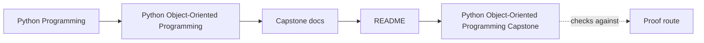
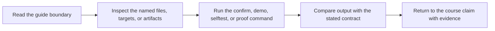
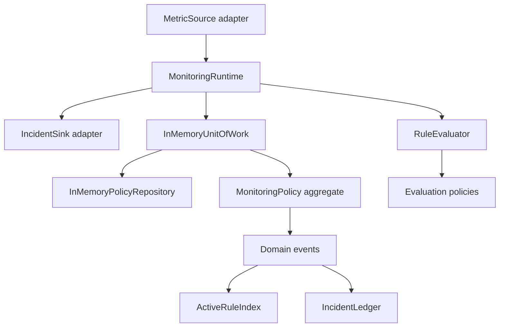

# Python Object-Oriented Programming Capstone


<!-- page-maps:start -->
## Guide Maps




<!-- page-maps:end -->

This capstone is a compact monitoring-system reference implementation. It exists to
make the course concrete: value objects, entities, rule lifecycles, aggregate roots,
evaluation policies, read models, runtime adapters, and unit-of-work boundaries are
all exercised in runnable code instead of only in chapter prose.

The scenario is deliberately human and operational:

- a team defines monitoring rules for a service
- rules move from draft to active to retired
- incoming metric samples are evaluated against those rules
- incidents are published without letting downstream views control domain state
- orchestration stays outside the aggregate so the domain model remains readable

## What it models

- threshold-based monitoring rules with explicit lifecycle states
- a `MonitoringPolicy` aggregate root that owns rule transitions and evaluation
- multiple evaluation policies: threshold, consecutive breach, and rate of change
- domain events for registration, activation, retirement, and alert triggering
- read models for active-rule indexing and incident history
- a `MonitoringRuntime` facade with source and sink adapters
- an in-memory unit of work with rollback semantics

## Run it

From this directory:

```bash
make confirm
```

Or from the repository root:

```bash
make PROGRAM=python-programming/python-object-oriented-programming test
```

## How to read this code

Start in this order:

1. `src/service_monitoring/application.py`
2. `src/service_monitoring/model.py`
3. `src/service_monitoring/policies.py`
4. `src/service_monitoring/runtime.py`
5. `src/service_monitoring/repository.py`
6. `src/service_monitoring/read_models.py`
7. `tests/`

That order mirrors the course: semantics first, then replaceable behavior, then orchestration.

## Design intent

The implementation deliberately stays small. The goal is not framework breadth. The
goal is to demonstrate a Python object model that remains readable under change:

- value types stay immutable and validated
- aggregates own invariants instead of scattering them
- strategy objects keep rule evaluation extensible without condition ladders
- events describe what happened without mutating projections directly
- a runtime facade keeps orchestration outside the aggregate
- repositories and unit-of-work boundaries make persistence intent explicit

## Study questions

- Which objects are authoritative, and which only derive views from events?
- Where would a new rule mode belong?
- Which behavior would be dangerous to move into the runtime?
- Which pieces can change without forcing a rewrite of the aggregate?

## Scenario walkthrough

Run the learner-facing scenario:

```bash
make demo
```

That path exercises the application surface in `application.py`, which is the best
place to start if you want to understand how a team would drive the capstone without
reaching into its internals first.

## Architecture



For a fuller boundary review, continue to [ARCHITECTURE.md](ARCHITECTURE.md).

## Layout

- `src/service_monitoring/model.py` contains the aggregate, rules, and alert model.
- `src/service_monitoring/policies.py` contains rule-evaluation strategy objects.
- `src/service_monitoring/read_models.py` contains downstream incident projections.
- `src/service_monitoring/runtime.py` contains the runtime facade and adapters.
- `tests/` contains executable behavioral checks across the full stack.
