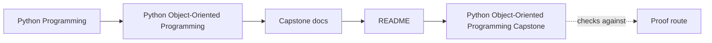
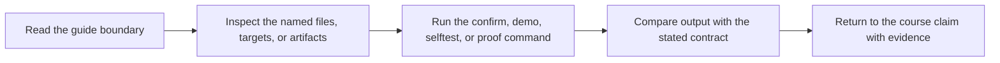
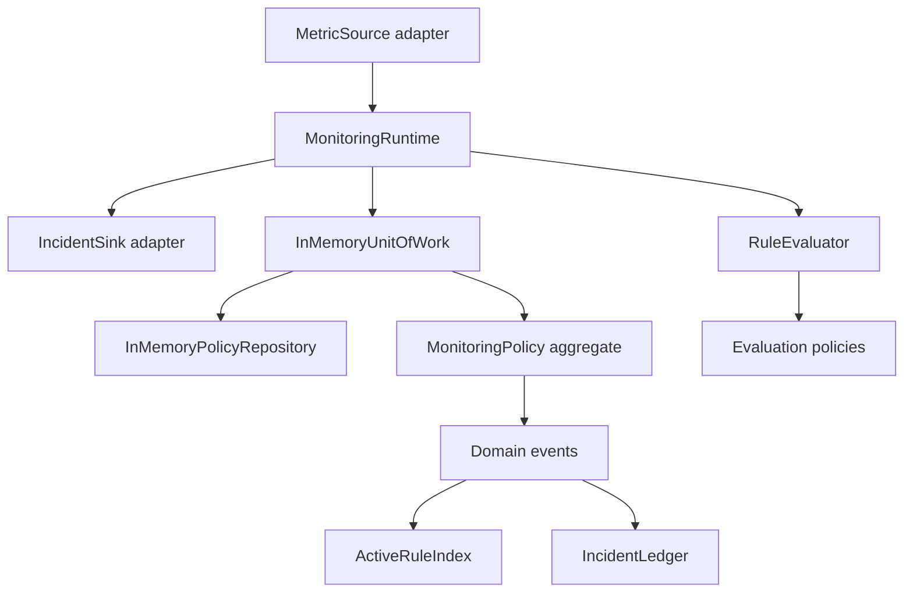

# Python Object-Oriented Programming Capstone


<!-- page-maps:start -->
## Guide Maps




<!-- page-maps:end -->

This capstone is a compact monitoring-system reference implementation. It exists to
make the course concrete: value objects, entities, rule lifecycles, aggregate roots,
evaluation policies, read models, runtime adapters, and unit-of-work boundaries are
all exercised in runnable code instead of only in chapter prose.

## Use this capstone for

- learning how the course’s ownership rules look in one executable system
- reviewing where domain logic ends and orchestration begins
- proving one design claim with the smallest honest command or saved bundle

## Do not use this capstone for

- memorizing file names before you know which boundary you are reviewing
- jumping straight to the strongest proof route when the question is still vague
- treating the runtime or CLI as if they were the source of domain authority

The scenario is deliberately human and operational:

- a team defines monitoring rules for a service
- rules move from draft to active to retired
- incoming metric samples are evaluated against those rules
- incidents are published without letting downstream views control domain state
- orchestration stays outside the aggregate so the domain model remains readable

## What it models

- threshold-based monitoring rules with explicit lifecycle states
- a `MonitoringPolicy` aggregate root that owns rule transitions and evaluation
- multiple evaluation policies: threshold, consecutive breach, and rate of change
- domain events for registration, activation, retirement, and alert triggering
- read models for active-rule indexing and incident history
- a `MonitoringRuntime` facade with source and sink adapters
- an in-memory unit of work with rollback semantics

## Run it

From this directory:

```bash
make proof
```

Or from the repository root:

```bash
make PROGRAM=python-programming/python-object-oriented-programming proof
```

Review and proof routes:

- [PROOF_GUIDE.md](PROOF_GUIDE.md)
- [ARCHITECTURE.md](ARCHITECTURE.md)
- [DOMAIN_GUIDE.md](DOMAIN_GUIDE.md)
- [SCENARIO_GUIDE.md](SCENARIO_GUIDE.md)
- [RULE_LIFECYCLE_GUIDE.md](RULE_LIFECYCLE_GUIDE.md)
- [EVENT_FLOW_GUIDE.md](EVENT_FLOW_GUIDE.md)
- [BUNDLE_GUIDE.md](BUNDLE_GUIDE.md)
- [CHANGE_RECIPES.md](CHANGE_RECIPES.md)
- [SOURCE_GUIDE.md](SOURCE_GUIDE.md)
- [COURSE_STAGE_MAP.md](COURSE_STAGE_MAP.md)
- [TOUR.md](TOUR.md)
- [PACKAGE_GUIDE.md](PACKAGE_GUIDE.md)
- [TEST_GUIDE.md](TEST_GUIDE.md)
- [TARGET_GUIDE.md](TARGET_GUIDE.md)
- [INSPECTION_GUIDE.md](INSPECTION_GUIDE.md)
- [EXTENSION_GUIDE.md](EXTENSION_GUIDE.md)

## First session route

If this is your first honest pass through the capstone, use this order:

1. Read this README until the scenario and review routes make sense.
2. Read [DOMAIN_GUIDE.md](DOMAIN_GUIDE.md).
3. Read [SCENARIO_GUIDE.md](SCENARIO_GUIDE.md).
4. Run `make demo`.
5. Read [RULE_LIFECYCLE_GUIDE.md](RULE_LIFECYCLE_GUIDE.md).
6. Read [TOUR.md](TOUR.md).
7. Read [PACKAGE_GUIDE.md](PACKAGE_GUIDE.md).
8. Read [SOURCE_GUIDE.md](SOURCE_GUIDE.md) if you want the file-and-class route before opening code.
9. Run `make inspect`.
10. Open [PROOF_GUIDE.md](PROOF_GUIDE.md) only after you can already name the likely owner of one behavior.

## Review routes

- `make inspect` writes a learner-facing inspection bundle with summary, lifecycle, and history outputs.
- `make inspect-timeline` prints the ordered scenario flow when you need sequence before proofs.
- `make tour` writes the walkthrough bundle with the scenario story and matching local guides.
- `make verify-report` writes the executable verification report bundle with test results and captured state.
- `make confirm` runs the strongest local confirmation route.
- `make proof` builds the published learner-facing review route.

Use [BUNDLE_GUIDE.md](BUNDLE_GUIDE.md) when you want the relationship between those saved
directories kept explicit.

## Route by reader goal

| If you want to... | Start with | Then |
| --- | --- | --- |
| understand the domain before reading code | this README, `DOMAIN_GUIDE.md`, and `RULE_LIFECYCLE_GUIDE.md` | `make demo` and `TOUR.md` |
| inspect ownership boundaries file by file | `PACKAGE_GUIDE.md` | `SOURCE_GUIDE.md` and `ARCHITECTURE.md` |
| confirm one design claim with evidence | `PROOF_GUIDE.md` | `make inspect` or `make verify-report` |
| review the full capstone as a learner-facing artifact | `make tour` | `make proof` |
| run the strongest local confirmation route | `make confirm` | `make proof` if you need the published bundle |

## What a good first read should settle

- what the system is modeling in plain operational language
- what the main domain terms mean before the file tree gets involved
- where the learner-facing application surface ends
- which object is authoritative for lifecycle and rule state
- which routes are for inspection, walkthrough, verification, and full proof

## Guided review route

| Review question | Inspect first | What to conclude | Strongest proof route |
| --- | --- | --- | --- |
| Do the core value and entity boundaries make sense? | `src/service_monitoring/model.py`, `tests/test_policy_lifecycle.py` | Identity, equality, and lifecycle semantics are explicit rather than accidental | `make inspect` |
| Is evaluation behavior owned by replaceable policy objects instead of condition ladders? | `src/service_monitoring/policies.py`, `tests/test_policy_evaluation.py` | Variation lives in named policy surfaces, not inside the aggregate | `make verify-report` |
| Does orchestration stay outside the aggregate? | `src/service_monitoring/runtime.py`, `src/service_monitoring/application.py`, `ARCHITECTURE.md` | Runtime coordination does not become the source of truth | `make tour` |
| Can the current design be reviewed as a learner-facing artifact instead of just a code dump? | `TOUR.md`, `INSPECTION_GUIDE.md`, `PROOF_GUIDE.md` | The capstone remains legible as a guided reference path | `make proof` |

Use this order repeatedly: inspect the named files, state the ownership claim, then run the smallest route that produces matching evidence.

## Common first-read mistakes

- starting in `runtime.py` before the scenario and aggregate are clear
- treating the tests as the only explanation of the design
- using `make proof` before the lighter routes have made the boundaries legible
- reading the read models as if they defined the authoritative state

## Inspect, explain, prove

Use this loop throughout the capstone:

1. Inspect one file, guide, or saved bundle.
2. Explain which object or boundary owns the behavior.
3. Prove that claim with one named command or one named test.

Use [COURSE_STAGE_MAP.md](COURSE_STAGE_MAP.md) when you want that loop tied directly to the current stage of the course instead of the full capstone at once.

## Currency audit

- Supported runtime: Python `>=3.10` as declared in `pyproject.toml`.
- Time semantics: domain timestamps use timezone-aware UTC (`datetime.now(timezone.utc)`), not naive `utcnow()`.
- Persistence scope: the shipped capstone keeps an in-memory repository and unit of work so storage concerns stay reviewable before database tooling enters the story.
- Concurrency scope: the capstone is intentionally synchronous today; concurrency and scheduling pressure are reviewed as design boundaries, not shipped runtime machinery.
- Serialization scope: learner-facing review artifacts are text and JSON bundles produced by the Make targets, not a stable network API contract.

## Definition of done

- `make test` passes with `PYTHONPATH=src`.
- `make inspect` produces readable summary, rules, and history bundles that match the documented scenario.
- `make tour` produces the walkthrough bundle without requiring learners to read internals first.
- `make verify-report` captures executable proof and learner-facing state in one saved review bundle.
- `make confirm` completes the strongest local confirmation route.
- `make proof` completes the full published learner route end to end.

## Read it by course stage

- Semantic floor: inspect the model and lifecycle tests first.
- Collaboration and evolution: inspect policies, read models, repository boundaries, and runtime coordination.
- Trust and governance: inspect bundles, proof routes, and public review outputs before reading internals.

## How to read this code

Start in this order:

1. `src/service_monitoring/application.py`
2. `src/service_monitoring/model.py`
3. `src/service_monitoring/policies.py`
4. `src/service_monitoring/runtime.py`
5. `src/service_monitoring/repository.py`
6. `src/service_monitoring/read_models.py`
7. `tests/`

That order mirrors the course: semantics first, then replaceable behavior, then orchestration.
Use `PACKAGE_GUIDE.md`, `TEST_GUIDE.md`, and `EXTENSION_GUIDE.md` when you need a narrower
reading route than the full overview.

## Design intent

The implementation deliberately stays small. The goal is not framework breadth. The
goal is to demonstrate a Python object model that remains readable under change:

- value types stay immutable and validated
- aggregates own invariants instead of scattering them
- strategy objects keep rule evaluation extensible without condition ladders
- events describe what happened without mutating projections directly
- a runtime facade keeps orchestration outside the aggregate
- repositories and unit-of-work boundaries make persistence intent explicit

## Study questions

- Which objects are authoritative, and which only derive views from events?
- Where would a new rule mode belong?
- Which behavior would be dangerous to move into the runtime?
- Which pieces can change without forcing a rewrite of the aggregate?

## Scenario walkthrough

Run the learner-facing scenario:

```bash
make demo
```

That path exercises the application surface in `application.py`, which is the best
place to start if you want to understand how a team would drive the capstone without
reaching into its internals first. Use `make tour` when you want that scenario captured
as a durable bundle instead of transient terminal output.

For the full narrative route, continue to [TOUR.md](TOUR.md).

## Architecture



For a fuller boundary review, continue to [ARCHITECTURE.md](ARCHITECTURE.md).

## Layout

- `src/service_monitoring/model.py` contains the aggregate, rules, and alert model.
- `src/service_monitoring/policies.py` contains rule-evaluation strategy objects.
- `src/service_monitoring/read_models.py` contains downstream incident projections.
- `src/service_monitoring/runtime.py` contains the runtime facade and adapters.
- `tests/` contains executable behavioral checks across the full stack.
