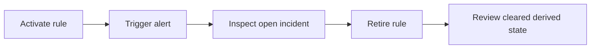
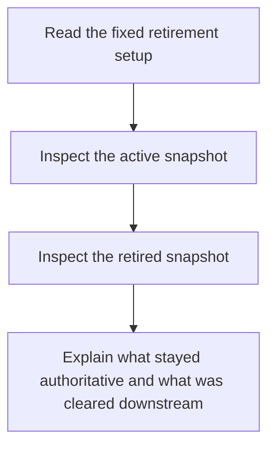

# Retirement Scenario Guide

<!-- page-maps:start -->
## Guide Maps

<!-- page-maps:end -->

Use this guide when you want the capstone to demonstrate full lifecycle ownership, not
just registration and activation. This local scenario shows how retirement changes both
authoritative and derived state.

## Fixed setup

- policy id: `service-monitoring-retirement`
- rule id: `disk-hot`
- metric: `disk`
- threshold: `0.85`
- severity: `warning`
- sample: `disk=0.91`
- retirement reason: `replaced by storage saturation policy`

## What should happen

1. The rule is registered and activated.
2. One observed sample triggers an open incident.
3. The rule is retired by the aggregate.
4. The rule remains in the retired lifecycle state.
5. The active-rule projection and open-incident projection are cleared for that rule.
6. The incident history remains as a derived record of what happened before retirement.

## Best local proof surfaces

- `tests/test_policy_lifecycle.py` for lifecycle ownership
- `tests/test_runtime.py` for projection cleanup after retirement
- `build_retirement_review()` in `scenario.py` for the fixed local contract

## Best companion guides

- read [RULE_LIFECYCLE_GUIDE.md](RULE_LIFECYCLE_GUIDE.md) when you want the state machine first
- read [EVENT_FLOW_GUIDE.md](EVENT_FLOW_GUIDE.md) when you want the projection handoff after retirement
- read [INSPECTION_GUIDE.md](INSPECTION_GUIDE.md) once the executable inspection route exists
