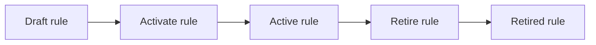
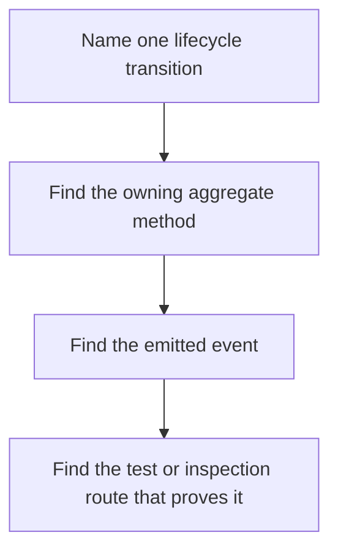

# Rule Lifecycle Guide

<!-- page-maps:start -->
## Guide Maps

<!-- page-maps:end -->

Use this guide when the capstone's rule states feel obvious in prose but harder to audit
in code. The goal is to make lifecycle authority explicit before you reason about runtime,
projections, or extension seams.

## States

| State | What it means | Who may change it |
| --- | --- | --- |
| `draft` | the rule exists but is not yet active for evaluation | `MonitoringPolicy` |
| `active` | the rule participates in evaluation and may emit alerts | `MonitoringPolicy` |
| `retired` | the rule is no longer active and keeps a retirement reason | `MonitoringPolicy` |

## Allowed transitions

| From | To | Why it matters |
| --- | --- | --- |
| not present | `draft` | registration creates the managed rule inside the aggregate |
| `draft` | `active` | activation makes the rule eligible for evaluation and projections |
| `draft` or `active` | `retired` | retirement closes further lifecycle movement and clears open incident state downstream |

## Prohibited transitions

- a retired rule may not become active again
- duplicate rule ids are rejected at registration time
- active rules may not share the same metric and window signature
- retirement requires a non-empty reason

## Event connection

| Transition | Emitted event | Downstream effect |
| --- | --- | --- |
| register rule | `RuleRegistered` | documents that the aggregate accepted the rule |
| activate rule | `RuleActivated` | updates the active rule index |
| retire rule | `RuleRetired` | removes active-read-model state and clears open incidents for that rule |
| evaluate active rule | `AlertTriggered` | records alert history and open incidents |

## Best proof surfaces

- read `tests/test_policy_lifecycle.py` for aggregate-owned transition rules
- read `tests/test_runtime.py` when you want lifecycle changes tied to projections
- run `make inspect` when you want the saved rule state after the fixed scenario

## Best companion guides

- read [DOMAIN_GUIDE.md](DOMAIN_GUIDE.md) when the terms still need grounding
- read [SCENARIO_GUIDE.md](SCENARIO_GUIDE.md) when you want the lifecycle stages tied to the fixed example
- read [PROOF_GUIDE.md](PROOF_GUIDE.md) when you want the stronger evidence route
