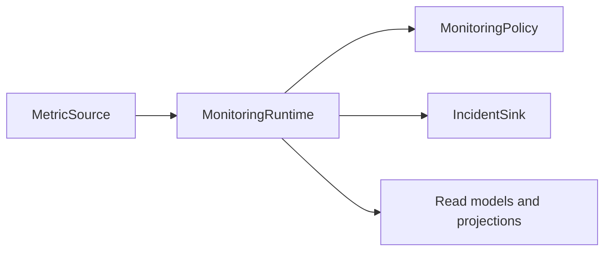
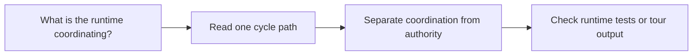

# Runtime Guide

<!-- page-maps:start -->
## Guide Maps

<!-- page-maps:end -->

Use this guide when the capstone's runtime feels like a vague middle layer. The goal is
to show exactly what orchestration the runtime owns and what must still remain outside it.

## What the runtime owns

- loading the aggregate through the repository and unit of work
- asking the aggregate to evaluate or change lifecycle state
- publishing alerts through the incident sink
- applying emitted events to projections and read models
- returning learner-facing cycle summaries

## What the runtime must not own

- deciding whether a lifecycle transition is legal
- hiding evaluation behavior that belongs to policy objects
- treating projections as authoritative domain state
- redefining persistence semantics that belong to the repository boundary

## Best code route

1. `MonitoringRuntime.register_policy`
2. `MonitoringRuntime.activate_rule`
3. `MonitoringRuntime.retire_rule`
4. `MonitoringRuntime.run_cycle`
5. `MonitoringRuntime.snapshot`

## Best companion proofs

- `tests/test_runtime.py` for orchestration and rollback behavior
- `TOUR.md` for the human-facing story of one runtime cycle
- `EVENT_FLOW_GUIDE.md` for the projection handoff after the runtime receives events
