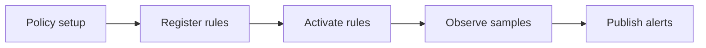
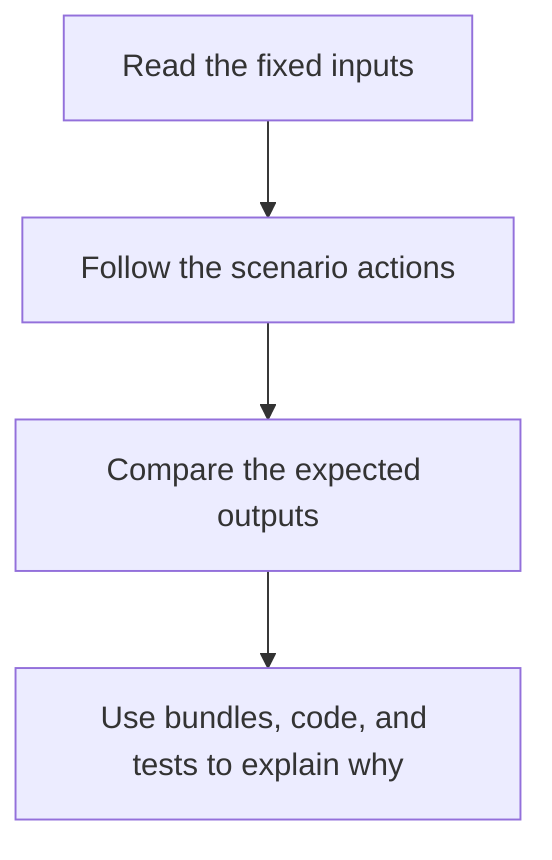

# Scenario Guide

<!-- page-maps:start -->
## Guide Maps

<!-- page-maps:end -->

Use this guide when you want the exact fixed example behind `make demo`, `make tour`,
and the CLI inspection routes. The goal is to keep the capstone's teaching scenario
stable and reviewable instead of hiding it in implementation details.

## Fixed policy

- policy id: `service-monitoring`
- monitored metric: `cpu`

## Fixed rule registrations

| Rule id | Mode | Threshold | Window | Severity | Meaning |
| --- | --- | --- | --- | --- | --- |
| `cpu-hot` | `threshold` | `0.9` | `1` | `critical` | fire when the latest sample breaches the hot threshold |
| `cpu-sustained` | `consecutive` | `0.8` | `3` | `warning` | fire when the latest three samples all stay above the sustained threshold |

## Fixed samples

| Timestamp | Metric | Value | Why it matters |
| --- | --- | --- | --- |
| `2026-04-02T09:00:00` | `cpu` | `0.82` | starts the sustained-evaluation window without triggering the hot rule |
| `2026-04-02T09:01:00` | `cpu` | `0.93` | breaches the hot threshold |
| `2026-04-02T09:02:00` | `cpu` | `0.95` | completes the sustained window and triggers both active rules |

## Expected outcomes

| Surface | Expected outcome |
| --- | --- |
| cycle report | `alerts_published = 2` |
| active rules | `cpu-hot`, `cpu-sustained` |
| open incidents | one for each active rule |
| incident history | two entries under the `cpu` metric |

## Best follow-up surfaces

- read [TOUR.md](TOUR.md) when you want the same scenario as a narrative route
- read [DOMAIN_GUIDE.md](DOMAIN_GUIDE.md) when the terms are still fuzzier than the sequence
- run `make inspect` when you want the saved outputs for this exact scenario
