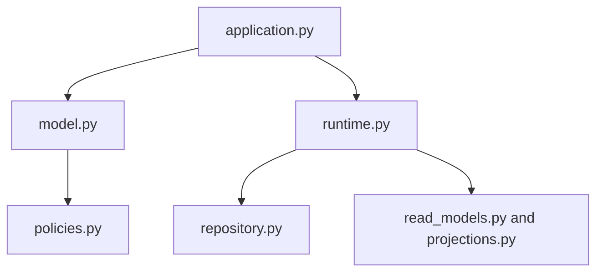

# Source Guide


<!-- page-maps:start -->
## Guide Maps



```mermaid
flowchart LR
  question["Name the code question"] --> file["Open the owning file"]
  file --> class["Find the main class or function"]
  class --> proof["Check the matching guide or test surface"]
```
<!-- page-maps:end -->

Use this guide when `PACKAGE_GUIDE.md` is still too coarse and you need the exact local
file-and-class route. The goal is to keep source reading deliberate instead of wandering
through files until something looks familiar.

## File and class map

| File | Start with | Best question |
| --- | --- | --- |
| `src/service_monitoring/application.py` | `MonitoringApplication` | what learner-facing operations exist before internals show up |
| `src/service_monitoring/model.py` | `MonitoringPolicy`, `ManagedRule`, `ThresholdRule` | who owns lifecycle, invariants, and alert creation |
| `src/service_monitoring/policies.py` | `RuleEvaluator` and the policy classes | where evaluation variability belongs |
| `src/service_monitoring/runtime.py` | `MonitoringRuntime` | what orchestration and adapter flow should stay outside the aggregate |
| `src/service_monitoring/repository.py` | `InMemoryPolicyRepository`, `InMemoryUnitOfWork` | how persistence intent and rollback stay explicit |
| `src/service_monitoring/read_models.py` | `IncidentLedger` | how incident history remains derived |
| `src/service_monitoring/projections.py` | `ActiveRuleIndex` | how active-rule lookup stays downstream of events |
| `src/service_monitoring/scenario.py` | `DEFAULT_RULE_REGISTRATIONS`, `DEFAULT_SAMPLES` | what fixed teaching scenario the capstone is using |
| `src/service_monitoring/demo.py` | `main` | how the staged walkthrough is assembled |
| `src/service_monitoring/cli.py` | `main` and `build_parser` | which local inspection surfaces the capstone publishes |

## Best reading routes by question

| If the question is... | Read in this order |
| --- | --- |
| who owns the rule lifecycle | `application.py`, `model.py`, `RULE_LIFECYCLE_GUIDE.md`, lifecycle tests |
| where a new evaluation mode belongs | `policies.py`, `model.py`, `CHANGE_RECIPES.md`, evaluation tests |
| how derived state is built | `runtime.py`, `read_models.py`, `projections.py`, `EVENT_FLOW_GUIDE.md` |
| how the learner-facing story is assembled | `scenario.py`, `demo.py`, `TOUR.md`, `WALKTHROUGH_GUIDE.md` |

## Best companion guides

- read [PACKAGE_GUIDE.md](PACKAGE_GUIDE.md) when you want the same route at package granularity
- read [RUNTIME_GUIDE.md](RUNTIME_GUIDE.md) when the runtime file needs a boundary-first explanation before line-by-line reading
- read [CHANGE_RECIPES.md](CHANGE_RECIPES.md) when the reading route has turned into an edit route
- read [TEST_GUIDE.md](TEST_GUIDE.md) when you need the executable surface that matches the source file
