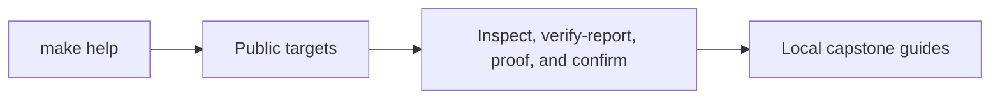
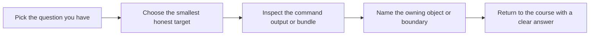

# Target Guide

<!-- page-maps:start -->
## Guide Maps

<!-- page-maps:end -->

Use this guide when `make help` shows several commands but the right one is still not
obvious. The goal is not target memorization. The goal is picking the smallest honest
command for the question you actually have.

## Stable targets

| Target | What it is for |
| --- | --- |
| `confirm` | run the strongest local confirmation route |
| `demo` | run the human-readable monitoring scenario |
| `inspect` | build the learner-facing inspection bundle |
| `inspect-timeline` | print the ordered scenario flow directly in the terminal |
| `tour` | build the learner-facing walkthrough bundle |
| `verify-report` | build the executable verification report bundle |
| `proof` | run the full course-sanctioned evidence route |

## Pick by output shape

| If you need... | Choose |
| --- | --- |
| terminal narrative only | `make demo` |
| saved learner-facing state files | `make inspect` |
| saved walkthrough story plus guide set | `make tour` |
| saved tests plus learner-facing state | `make verify-report` |
| the strongest local confidence bar | `make confirm` |
| the published end-to-end learner route | `make proof` |

## Fast target selection

### If the question is "does the design still hold?"

Use:

* `make confirm`

### If the question is "can I understand the scenario as a human?"

Use:

* `make demo`
* `make tour`
* `TOUR.md`

### If the question is "what is the current capstone state?"

Use:

* `make inspect`
* `INSPECTION_GUIDE.md`

### If the question is "in what order did the teaching scenario happen?"

Use:

* `make inspect-timeline`
* `SCENARIO_GUIDE.md`
* `EVENT_FLOW_GUIDE.md`

### If the question is "what saved bundle proves the behavior?"

Use:

* `make verify-report`
* `PROOF_GUIDE.md`

### If the question is "what is the strongest published route?"

Use:

* `make proof`

## Important distinctions

- `confirm` versus `proof`
  `confirm` proves the local route as strongly as possible; `proof` builds the published learner-facing evidence route.
- `demo` versus `tour`
  `demo` tells the story directly in the terminal; `tour` saves that story with matching review guides.
- `inspect` versus `verify-report`
  `inspect` focuses on learner-facing state; `verify-report` combines tests and saved state for stronger review.

## Signs a target is too heavy

- you ran it mainly because it felt safer than naming the real question
- the output answered several things, but not the one boundary you were reviewing
- a lighter route could already have told you which file or test to open next

## Best companion guides

Read these with the target guide:

* `PACKAGE_GUIDE.md`
* `TEST_GUIDE.md`
* `WALKTHROUGH_GUIDE.md`
* `PROOF_GUIDE.md`
* `INSPECTION_GUIDE.md`
* `BUNDLE_GUIDE.md`
* `EXTENSION_GUIDE.md`
