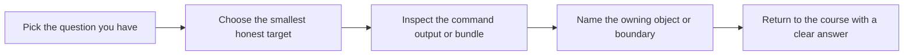

# Target Guide

<!-- page-maps:start -->
## Guide Maps

<!-- page-maps:end -->

Use this guide when `make help` shows several commands but the right one is still not
obvious. The goal is not target memorization. The goal is picking the smallest honest
command for the question you actually have.

## Stable targets

| Target | What it is for |
| --- | --- |
| `confirm` | run the executable confirmation suite |
| `demo` | run the human-readable monitoring scenario |
| `inspect-summary` | inspect the policy snapshot and open incidents |
| `inspect-rules` | inspect rule lifecycle state by category |
| `inspect-history` | inspect incident history grouped by metric |
| `proof` | run the full course-sanctioned evidence route |

## Fast target selection

### If the question is "does the design still hold?"

Use:

* `make confirm`

### If the question is "can I understand the scenario as a human?"

Use:

* `make demo`
* `TOUR.md`

### If the question is "what is the current capstone state?"

Use:

* `make inspect-summary`
* `make inspect-rules`
* `make inspect-history`

### If the question is "what is the strongest published route?"

Use:

* `make proof`

## Important distinctions

- `confirm` versus `proof`
  `confirm` proves behavior with tests; `proof` combines tests, walkthrough, and inspection routes.
- `demo` versus `inspect-summary`
  `demo` tells the scenario story; `inspect-summary` gives a compact state snapshot.
- `inspect-rules` versus `inspect-history`
  rule inspection explains lifecycle state; history inspection explains incident accumulation.

## Best companion guides

Read these with the target guide:

* `PACKAGE_GUIDE.md`
* `TEST_GUIDE.md`
* `WALKTHROUGH_GUIDE.md`
* `PROOF_GUIDE.md`
