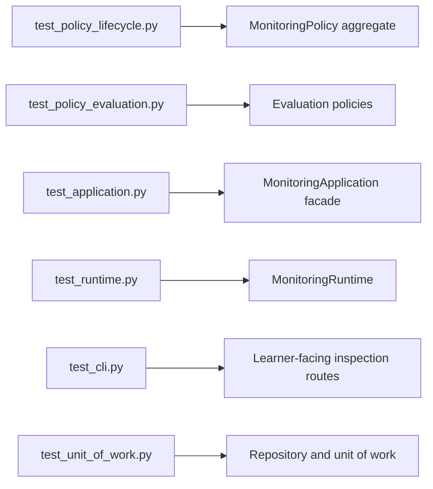
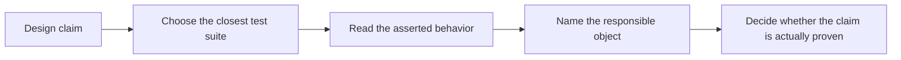

# Test Guide

<!-- page-maps:start -->
## Guide Maps

<!-- page-maps:end -->

Use this guide when you trust the test count less than the test shape. The goal is to map
each suite to the boundary it is defending instead of reading `tests/` alphabetically.

## Test route

1. `tests/test_policy_lifecycle.py`
2. `tests/test_policy_evaluation.py`
3. `tests/test_application.py`
4. `tests/test_runtime.py`
5. `tests/test_unit_of_work.py`
6. `tests/test_cli.py`

That route moves from aggregate authority into orchestration, persistence, and finally
the learner-facing review surface.

## What each suite proves

| Test file | Main proof question |
| --- | --- |
| `test_policy_lifecycle.py` | does the aggregate own lifecycle change directly and reject invalid transitions |
| `test_policy_evaluation.py` | do policy objects express evaluation behavior without leaking it into the aggregate |
| `test_application.py` | does the learner-facing facade preserve readable use cases without hiding domain ownership |
| `test_runtime.py` | does runtime coordination stay outside the aggregate while still publishing incidents correctly |
| `test_unit_of_work.py` | do repository and rollback boundaries behave as explicit persistence intent |
| `test_cli.py` | do the learner-facing inspection commands reflect the scenario honestly |

## Best review questions

- Which test would fail first if rule activation moved out of the aggregate?
- Which test would fail first if a new rule mode were implemented with condition ladders?
- Which test would fail first if projections started mutating authoritative state?
- Which test would fail first if the learner-facing inspection route stopped matching the scenario?

## What this guide prevents

- counting green tests without knowing what they prove
- using runtime tests to justify domain ownership claims
- treating CLI output as if it were stronger proof than domain or runtime tests
- missing the difference between application-surface readability and aggregate authority
