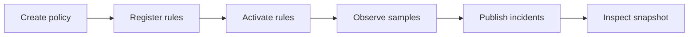
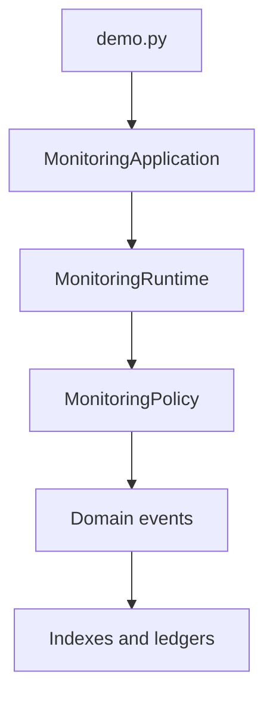

# Tour Guide

<!-- page-maps:start -->
## Guide Maps

<!-- page-maps:end -->

This guide explains the capstone as a narrative, not only as a file tree. Read it before
or after running `make demo`. Use `make tour` when you want this narrative captured as a
bundle instead of only printed once in the terminal.

## Scenario route

1. Create one monitoring policy.
2. Register rules while they are still in draft state.
3. Activate the rules deliberately.
4. Observe metric samples through the application surface.
5. Let the runtime publish alerts and update downstream views.
6. Inspect the resulting summary, active rule index, and open incidents.

## Best command route

1. Run `make demo` when you want the narrative directly in the terminal.
2. Run `make tour` when you want `walkthrough.txt`, the local guide set, and a stable manifest for review.
3. Compare the walkthrough bundle with `ARCHITECTURE.md` and `WALKTHROUGH_GUIDE.md`.

## Why this route matters

The tour reveals the architectural promise of the capstone:

- the learner drives the system through a readable application surface
- the aggregate stays responsible for lifecycle and evaluation decisions
- the runtime coordinates external concerns without owning the domain rules
- the read models remain derived artifacts after events are emitted

## Best files to read during the tour

- `src/service_monitoring/demo.py`
- `src/service_monitoring/application.py`
- `src/service_monitoring/runtime.py`
- `src/service_monitoring/model.py`
- `src/service_monitoring/read_models.py`
- `TARGET_GUIDE.md`
- `WALKTHROUGH_GUIDE.md`
