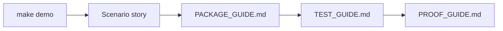
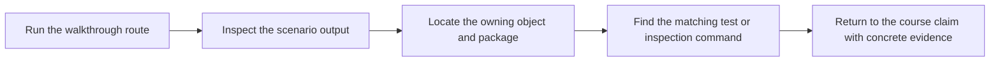

# Walkthrough Guide

<!-- page-maps:start -->
## Guide Maps

<!-- page-maps:end -->

Use this guide when you want the shortest sane first pass through the capstone. It is for
learners who need a deliberate route from scenario story to ownership and proof.

## Recommended first route

1. Run `make demo`.
2. Read `TOUR.md`.
3. Read `PACKAGE_GUIDE.md`.
4. Run `make inspect-summary` and `make inspect-history`.
5. Read `TEST_GUIDE.md`.
6. Read `PROOF_GUIDE.md`.

That route keeps story first, package ownership second, inspection third, and proof last.

## What to look for

- where the learner-facing application surface ends and aggregate authority begins
- how a rule moves from registration to activation before evaluation
- where incidents become derived views instead of authoritative state
- which inspection route is best for summary, rule state, or incident history

## Walkthrough checkpoints

| After you inspect... | You should be able to answer... | If not, go next to... |
| --- | --- | --- |
| `make demo` output | what story the learner can follow without internals and where each stage hands off | `TOUR.md` |
| `TOUR.md` | where the scenario hands off from application surface to domain ownership | `PACKAGE_GUIDE.md` |
| inspection bundles | which outputs describe state versus derived incident history | `INSPECTION_GUIDE.md` |
| `TEST_GUIDE.md` | which suite would fail first if the story stopped matching the design | `PROOF_GUIDE.md` |

## Time-boxed routes

### 15-minute route

* `make demo`
* `TOUR.md`
* `PACKAGE_GUIDE.md`

Goal: understand the scenario and the main ownership boundaries.

### 30-minute route

* 15-minute route
* `make inspect-summary`
* `make inspect-history`
* `TEST_GUIDE.md`

Goal: connect the story to the learner-facing review surfaces and the tests.

### 45-minute route

* 30-minute route
* `ARCHITECTURE.md`
* `PROOF_GUIDE.md`
* one matching test file

Goal: connect the story to architecture and executable proof.

## Exit criteria

The walkthrough has worked if you can answer all of these:

- which object owns lifecycle authority
- which package would receive a new evaluation mode
- which inspection command best shows summary versus rule state versus incident history
- which test or proof route you would run before extending the capstone

## Best comparison pass

1. Compare the walkthrough story with `PACKAGE_GUIDE.md` to confirm where each step belongs.
2. Compare the walkthrough story with `ARCHITECTURE.md` to confirm which boundaries must stay thin.
3. Compare the walkthrough story with `PROOF_GUIDE.md` to confirm which evidence route is proportionate.
