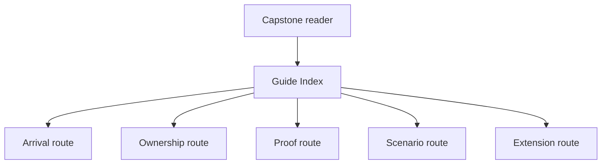
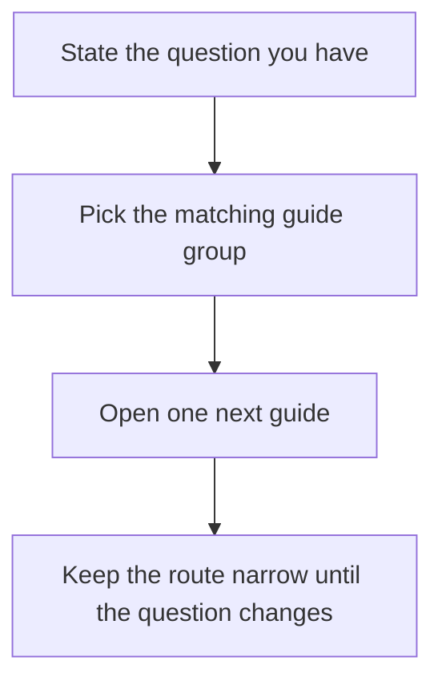

# Monitoring System Guide Index

Use this page when you already know the capstone is the right place to look, but you do
not yet know which local guide answers your question fastest. The goal is to keep the
capstone doc set reviewable instead of making learners rescan the README every time.

## If you are just arriving

- `FIRST_SESSION_GUIDE.md`
- `README.md`
- `DOMAIN_GUIDE.md`
- `SCENARIO_GUIDE.md`

## If you want the ownership route

- `OWNERSHIP_BOUNDARIES.md`
- `ARCHITECTURE.md`
- `PACKAGE_GUIDE.md`
- `SOURCE_GUIDE.md`

## If you want the proof route

- `COMMAND_GUIDE.md`
- `PROOF_GUIDE.md`
- `TEST_GUIDE.md`
- `INSPECTION_GUIDE.md`
- `TOUR.md`

## If you want the scenario route

- `SCENARIO_BOUNDARY_MAP.md`
- `SCENARIO_GUIDE.md`
- `RULE_LIFECYCLE_GUIDE.md`
- `EVENT_FLOW_GUIDE.md`
- `SCENARIO_SELECTION_GUIDE.md`

## If you want the extension route

- `EXTENSION_GUIDE.md`
- `CHANGE_RECIPES.md`
- `PUBLIC_API_GUIDE.md`

## If you only need one next file

- "What does this system model?" -> `README.md`
- "Which boundary owns this behavior?" -> `ARCHITECTURE.md`
- "Which scenario shows this pressure?" -> `SCENARIO_BOUNDARY_MAP.md`
- "Which guide explains the file route?" -> `SOURCE_GUIDE.md`
- "Which command or saved bundle should I use?" -> `COMMAND_GUIDE.md`
- "Where should a change land?" -> `EXTENSION_GUIDE.md`

## Best next file after this one

If you do not have a sharper question yet, read `FIRST_SESSION_GUIDE.md`.
