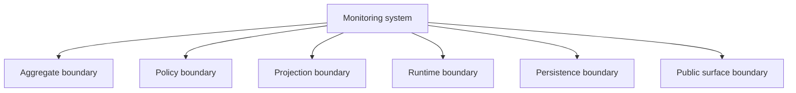
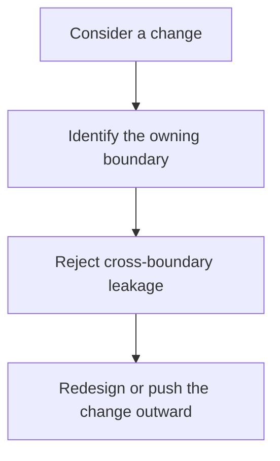

# Ownership Boundaries

Use this guide when the capstone technically makes sense but you still need one page that
states who owns what, who only derives views, and what kinds of changes should be rejected
or pushed outward.

## Aggregate boundary

Owner:

- `MonitoringPolicy` in `src/service_monitoring/model.py`

This boundary owns:

- lifecycle transitions for monitoring rules
- cross-rule authority during registration, activation, retirement, and incident creation
- domain events that describe authoritative changes

This boundary does not own:

- persistence mechanics
- projection updates as the source of truth
- runtime coordination or adapter I/O

Reject or redesign when:

- runtime code starts bypassing aggregate methods to mutate rule state
- projections begin deciding domain truth
- policy variation is encoded as condition ladders inside the aggregate instead of a stable seam

## Policy boundary

Owners:

- evaluation strategy types in `src/service_monitoring/policies.py`

This boundary owns:

- evaluation variation
- threshold, consecutive-breach, and rate-of-change logic
- replaceable behavior that should not widen the aggregate's authority

This boundary does not own:

- repository access
- orchestration timing
- domain lifecycle authority

Reject or redesign when:

- a policy object starts reaching into storage or runtime concerns
- evaluation variation becomes coupled to transport, logging, or adapter details
- the aggregate stops being able to explain the contract around a policy seam

## Projection boundary

Owners:

- read-model and projection surfaces such as `read_models.py` and `projections.py`

This boundary owns:

- derived views of active rules and incident history
- post-event read models meant to support inspection and reporting

This boundary does not own:

- authoritative lifecycle state
- rule registration or activation decisions
- mutation of aggregate truth

Reject or redesign when:

- a projection becomes a hidden write model
- downstream reporting surfaces begin deciding what the domain means
- projections can drift silently because no event or test route would notice first

## Runtime boundary

Owners:

- `runtime.py`, `application.py`, and the demo and CLI entry surfaces

This boundary owns:

- coordination across sources, sinks, repositories, and the aggregate
- scenario execution, command entrypoints, and learner-facing review output
- retries, scheduling, or surrounding operational concerns that belong outside the model

This boundary does not own:

- domain truth
- storage semantics disguised as orchestration
- projection authority

Reject or redesign when:

- the runtime becomes the place where invariants are enforced first
- operational convenience starts bypassing aggregate methods
- a learner can no longer tell whether behavior belongs to the model or to orchestration

## Persistence boundary

Owners:

- repository and unit-of-work surfaces

This boundary owns:

- translating authoritative state into storage or in-memory retention
- commit and rollback semantics
- keeping persistence replaceable without flattening the domain

This boundary does not own:

- domain rules
- public API governance
- direct scenario narration

Reject or redesign when:

- repository code starts constructing semantically invalid aggregates
- storage shape becomes the apparent domain model
- commit or rollback logic leaks into the aggregate

## Public surface boundary

Owners:

- `application.py`, public CLI routes, and the published learner-facing bundles

This boundary owns:

- what another human reader or consumer is meant to rely on
- narrow extension and inspection seams that can actually be documented and defended

This boundary does not own:

- deep internal imports as accidental extension points
- hidden behavior that cannot be reached through public guides or proof routes

Reject or redesign when:

- a deep internal module becomes the de facto public API
- extension pressure requires violating aggregate or runtime ownership
- the published bundles no longer reflect the surface you claim is stable

## Best companion files

- `ARCHITECTURE.md`
- `PACKAGE_GUIDE.md`
- `PROJECTION_GUIDE.md`
- `PUBLIC_API_GUIDE.md`
- `EXTENSION_GUIDE.md`
