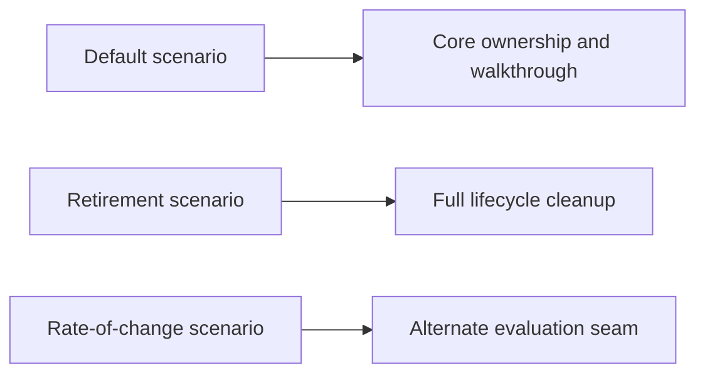
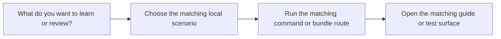

# Scenario Selection Guide

<!-- page-maps:start -->
## Guide Maps

<!-- page-maps:end -->

Use this guide when the capstone now offers several local scenarios and you want the
smallest honest one for the question in front of you.

## Scenario matrix

| Scenario | Best question | Best route | Best companion proof |
| --- | --- | --- | --- |
| default scenario | how the capstone's main ownership story works end to end | `make demo`, `make inspect`, `SCENARIO_GUIDE.md` | lifecycle, application, and runtime tests |
| retirement scenario | what retirement changes in authoritative and derived state | `make inspect-retirement`, `RETIREMENT_SCENARIO_GUIDE.md` | lifecycle and runtime tests |
| rate-of-change scenario | whether the policy seam is real instead of decorative | `make inspect-rate-of-change`, `RATE_OF_CHANGE_SCENARIO_GUIDE.md` | evaluation tests |
| structured snapshot | how to diff or script the default scenario state | `make inspect-json`, `snapshot.json` | CLI tests and bundle review |

## Best entry by learner need

- start with the default scenario if the capstone is still new
- jump to the retirement scenario if the lifecycle story still feels incomplete
- jump to the rate-of-change scenario if evaluation variability still feels hand-wavy
- use the structured snapshot if the story is already clear and you need machine-readable review

## Best companion guides

- read [TARGET_GUIDE.md](TARGET_GUIDE.md) when you want the command choice restated at the target level
- read [BUNDLE_GUIDE.md](BUNDLE_GUIDE.md) when the scenario should be reviewed through saved directories
- read [INDEX.md](INDEX.md) when you want the scenario choice tied back to the wider course
