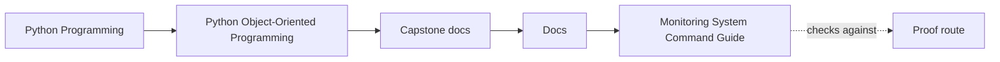
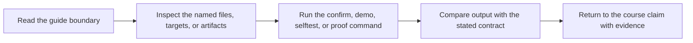
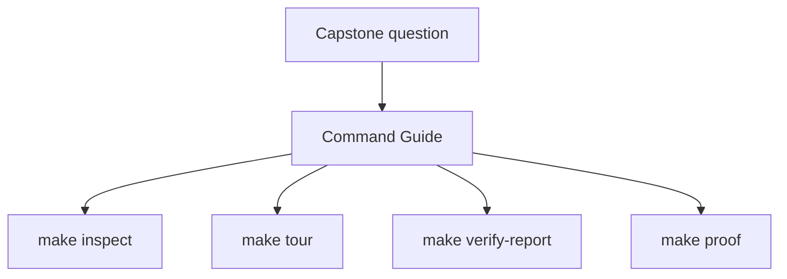
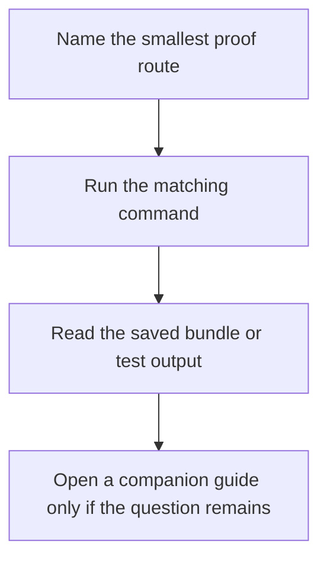

# Monitoring System Command Guide

<!-- page-maps:start -->
## Guide Maps

<!-- page-maps:end -->

Use this page when you know the question is inside the capstone, but you are not sure
which command gives the smallest honest proof surface. The goal is to match the route to
the question instead of defaulting to the heaviest command.

## Choose the route by goal

| If you want to... | Run | What you get |
| --- | --- | --- |
| inspect the current scenario state quickly | `make inspect` | a saved inspection bundle with summary, rules, history, variants, and local guides |
| walk the scenario route first | `make tour` | a walkthrough bundle with scenario output and reading routes |
| capture executable proof plus saved artifacts | `make verify-report` | pytest output plus saved review surfaces |
| run the complete published review route | `make proof` | inspect, tour, and verify-report together |
| run the simplest executable test route | `make test` | the pytest suite only |
| run the strongest local confirmation route | `make confirm` | test plus the full proof route |

## Choose the route by pressure

- If the question is "what does the system currently do?" start with `make inspect`.
- If the question is "how does the story unfold before opening internals?" start with `make tour`.
- If the question is "what evidence should I save for review?" start with `make verify-report`.
- If the question is "does the published route still hold end to end?" use `make proof`.
- If the question is only "are the tests green?" use `make test`.

## Artifact locations

- `make inspect` writes to `artifacts/inspect/python-programming/python-object-oriented-programming/`
- `make tour` writes to `artifacts/tour/python-programming/python-object-oriented-programming/`
- `make verify-report` writes to `artifacts/review/python-programming/python-object-oriented-programming/`

## Common command mistakes

- using `make proof` before the boundary question is clear
- reading raw test output when the saved inspection or walkthrough bundle would answer the question better
- treating `make test` as equivalent to the full proof route
- skipping straight to `make confirm` when a lighter route would expose the same issue faster

## Best companion files

- `INDEX.md`
- `PROOF_GUIDE.md`
- `PROOF_GUIDE.md`
- `COMMAND_GUIDE.md`
