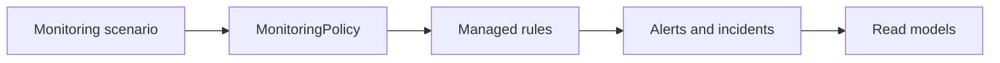
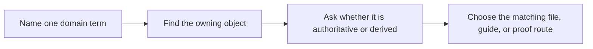

# Domain Guide

<!-- page-maps:start -->
## Guide Maps

<!-- page-maps:end -->

Use this guide when the capstone feels readable at the file level but fuzzy at the domain
level. The goal is to keep the monitoring language concrete before you reason about
architecture, tests, or extension seams.

## What the system is modeling

The capstone models one monitoring policy for one service. That policy owns a set of
rules. Rules start in draft, may become active, and may later be retired. Incoming metric
samples are evaluated against the active rules. Matching evaluations publish alerts, and
the downstream read models record those alerts as open incidents and incident history.

## Core terms

| Term | Meaning in this capstone | Owning surface |
| --- | --- | --- |
| monitoring policy | the aggregate root that owns rule registration, activation, retirement, and alert evaluation | `model.py` |
| rule | a threshold-based definition for one metric, severity, window, and evaluation mode | `model.py` |
| managed rule | the current lifecycle state wrapped around one rule definition | `model.py` |
| evaluation policy | a replaceable strategy for interpreting samples against a rule | `policies.py` |
| alert | the authoritative domain result of one successful evaluation | `model.py` |
| incident snapshot | a read-model view of an alert for inspection output | `read_models.py` |
| active rule index | a derived lookup that shows which rules are active by metric | `projections.py` |

## What is authoritative versus derived

| Surface | Role |
| --- | --- |
| `MonitoringPolicy` and its managed rules | authoritative domain state |
| emitted domain events | durable description of what happened |
| `ActiveRuleIndex` and `IncidentLedger` | derived read-model state |
| CLI output and saved bundles | guided review artifacts |

## Questions this guide should settle

- which object may accept or reject a lifecycle change
- which surface exists only to make review or inspection easier
- where a new evaluation behavior would belong without widening the aggregate
- which output is safe to inspect without mistaking it for the source of truth

## Best companion guides

- read [DOMAIN_GUIDE.md](domain-guide.md) when you want the exact fixed example used by the capstone
- read [ARCHITECTURE.md](architecture.md) when you want boundary direction after the vocabulary is clear
- read [PACKAGE_GUIDE.md](package-guide.md) when you want the file route for the same domain terms
