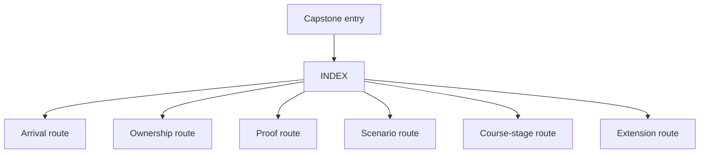
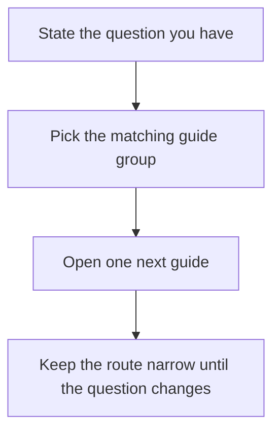

# Monitoring System Capstone Docs

Use this page when you know the capstone is the right place to look but you still need
the smallest honest route into it. It combines the old arrival pages and the course-stage
map so the capstone has one stable entry hub instead of several overlapping starts.

## First honest pass

1. Read `README.md`.
2. Read `DOMAIN_GUIDE.md`.
3. Read `ARCHITECTURE.md`.
4. Run `make demo`.
5. Read `DOMAIN_GUIDE.md` or `ARCHITECTURE.md`, depending on whether the pressure is lifecycle or collaboration.
6. Stop there unless you already have a specific proof question.

## If you only need one next file

- "What does this system model?" -> `README.md`
- "Which boundary owns this behavior?" -> `ARCHITECTURE.md`
- "Which scenario shows this pressure?" -> `DOMAIN_GUIDE.md`
- "Which command or saved bundle should I use?" -> `COMMAND_GUIDE.md`
- "Where should a change land?" -> `EXTENSION_GUIDE.md`

## Route groups

- Arrival route: `README.md`, `DOMAIN_GUIDE.md`, `ARCHITECTURE.md`
- Ownership route: `ARCHITECTURE.md`, `ARCHITECTURE.md`, `PACKAGE_GUIDE.md`
- Proof route: `COMMAND_GUIDE.md`, `PROOF_GUIDE.md`, `TEST_GUIDE.md`, `TOUR.md`
- Scenario route: `DOMAIN_GUIDE.md`, `DOMAIN_GUIDE.md`, `ARCHITECTURE.md`
- Extension route: `EXTENSION_GUIDE.md`, `COMMAND_GUIDE.md`

## Route by course stage

| Course stage | Start here | Then inspect | Best command |
| --- | --- | --- | --- |
| Semantic floor | `src/service_monitoring/model.py` | `tests/test_policy_lifecycle.py`, `PACKAGE_GUIDE.md`, and the default scenario | `make inspect` |
| Collaboration and evolution | `ARCHITECTURE.md` | `runtime.py`, `repository.py`, `read_models.py`, and the retirement scenario | `make verify-report` |
| Trust and governance | `PROOF_GUIDE.md` | saved bundles, `TEST_GUIDE.md`, `EXTENSION_GUIDE.md`, and the rate-of-change scenario | `make confirm` or `make proof` |

## Good stopping point

Stop when you can answer:

- what object is authoritative for rule lifecycle and alert creation
- which artifacts are derived views rather than the source of truth
- which local command you should use next, and why it is the smallest honest route
