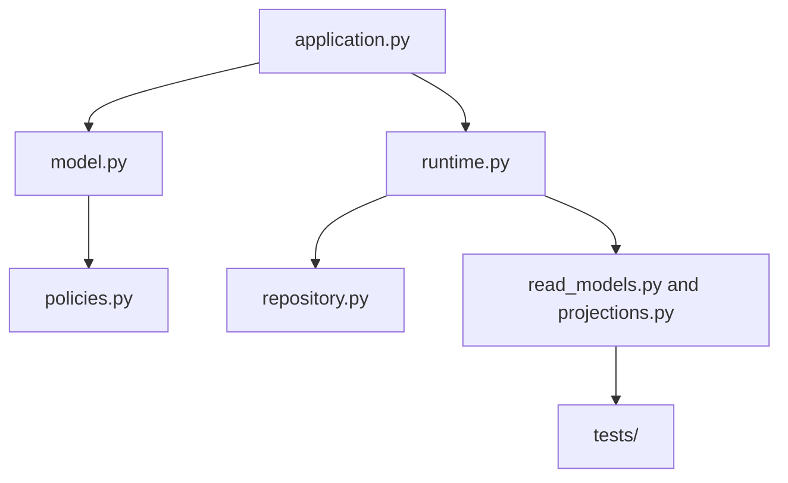
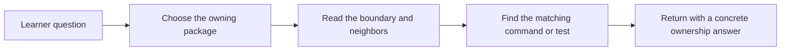

# Package Guide

<!-- page-maps:start -->
## Guide Maps

<!-- page-maps:end -->

Use this guide when the capstone still feels like a list of Python files instead of a
system with named responsibilities. The goal is to know which package owns a decision
before you start tracing methods line by line.

## Reading route

1. `src/service_monitoring/application.py`
2. `src/service_monitoring/model.py`
3. `src/service_monitoring/policies.py`
4. `src/service_monitoring/runtime.py`
5. `src/service_monitoring/repository.py`
6. `src/service_monitoring/read_models.py`
7. `src/service_monitoring/projections.py`
8. `tests/`

That route keeps public use cases first, domain ownership second, runtime
coordination third, and proof surfaces last.

## Package responsibilities

| Surface | What it owns | What it should not own |
| --- | --- | --- |
| `application.py` | readable use-case commands and observation entrypoints | domain invariants or persistence policy |
| `model.py` | aggregate lifecycle, rule authority, and invariant enforcement | external publication or storage mechanics |
| `policies.py` | replaceable rule-evaluation behavior | aggregate lifecycle and orchestration |
| `runtime.py` | source, sink, projection, and unit-of-work coordination | rule ownership or lifecycle authority |
| `repository.py` | persistence intent and rollback boundary | business rules hidden behind storage |
| `read_models.py` and `projections.py` | derived views and event-driven summaries | authoritative domain change |
| `tests/` | executable proof of the published behavior | design authority without evidence |

## Best questions by file

- Open `application.py` when you want the shortest human-readable entry surface.
- Open `model.py` when you need to know who may accept or reject a lifecycle change.
- Open `policies.py` when you need to place a new rule mode without condition ladders.
- Open `runtime.py` when you need to review orchestration boundaries.
- Open `repository.py` when you need to inspect persistence or rollback intent.
- Open `read_models.py` and `projections.py` when you need to confirm which views are derived.

## Best starting point by change

| If the proposed change is about... | Start here | Keep this neighbor open too |
| --- | --- | --- |
| a new public use case | `application.py` | `model.py` |
| a lifecycle or invariant rule | `model.py` | `tests/test_policy_lifecycle.py` |
| a new evaluation behavior | `policies.py` | `model.py` |
| runtime coordination or adapters | `runtime.py` | `application.py` |
| persistence or rollback semantics | `repository.py` | `runtime.py` |
| a new read concern or summary view | `read_models.py` or `projections.py` | emitted events and runtime flow |

## Where not to start

- do not start in `runtime.py` when the question is about who may accept a domain change
- do not start in `read_models.py` when the question is about authoritative state
- do not start in `tests/` before you can say which package is supposed to own the behavior

## What this guide prevents

- starting in infrastructure and mistaking it for the domain core
- treating read models as if they were authoritative state
- putting a new rule mode into the runtime instead of the policy seam
- reaching for tests before you know which package is supposed to own the behavior

Read [EXTENSION_GUIDE.md](extension-guide.md) when you want those file choices turned into
concrete local edit sequences.

Read [PACKAGE_GUIDE.md](package-guide.md) when you want the next layer down: the exact
file-and-class route inside those package choices.

Read [COMMAND_GUIDE.md](command-guide.md) when the question is no longer only
internal file ownership, but what should count as the supported package surface.
