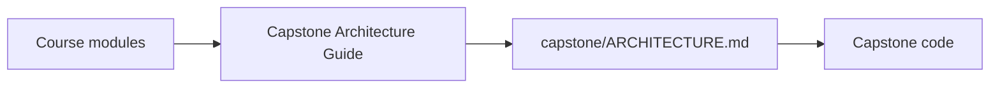
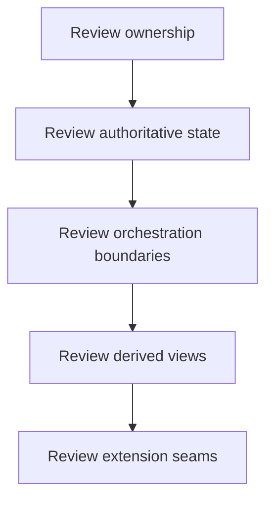

# Capstone Architecture Guide

<!-- page-maps:start -->
## Page Maps

<!-- page-maps:end -->

Use this page when a module asks you to review the capstone's architecture instead of
only its syntax.

## What to inspect

1. Read [capstone/ARCHITECTURE.md](../capstone/ARCHITECTURE.md).
2. Compare it with [Capstone](capstone.md) and [Capstone File Guide](capstone-file-guide.md).
3. Inspect `application.py`, `model.py`, `runtime.py`, and `read_models.py` in that order.

## What the architecture should prove

- the aggregate owns lifecycle and invariant decisions
- orchestration stays outside the domain model
- replaceable policies carry evaluation variability
- projections derive views from events instead of controlling the model
- persistence and rollback concerns stay explicit

## Best use inside the course

- Use it after Module 04 to review aggregate and event boundaries.
- Revisit it after Modules 06 and 07 to confirm persistence and runtime pressure did not blur ownership.
- Revisit it again in Module 10 when reviewing observability and hardening choices.
