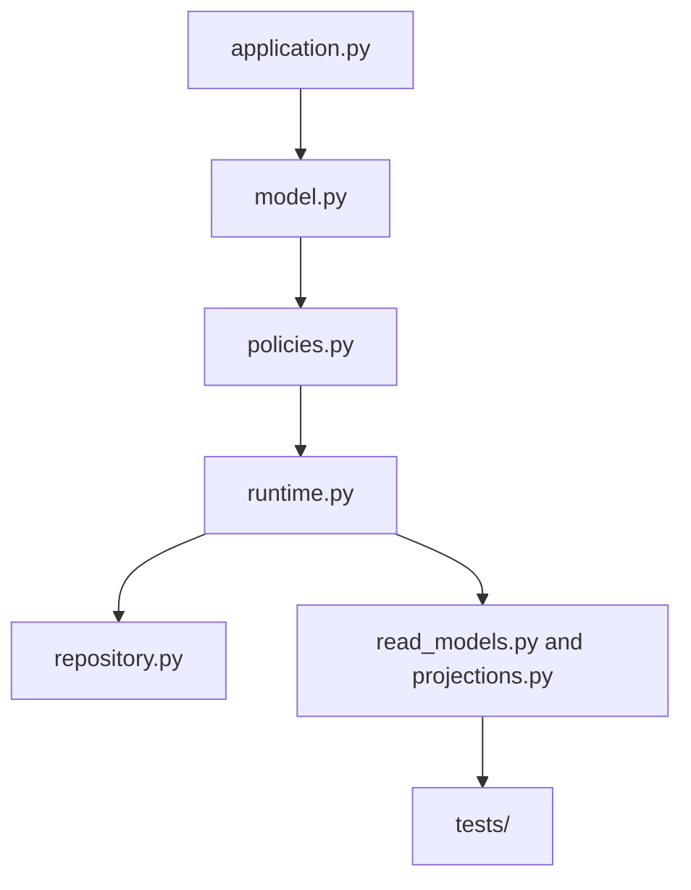
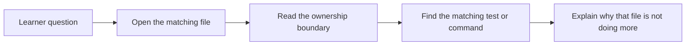

# Capstone File Guide

<!-- page-maps:start -->
## Page Maps

<!-- page-maps:end -->

This guide gives the capstone a human reading order. The goal is not to read every file
alphabetically. The goal is to understand how the system is partitioned.

## Recommended reading order

1. `src/service_monitoring/application.py`
2. `src/service_monitoring/model.py`
3. `src/service_monitoring/policies.py`
4. `src/service_monitoring/runtime.py`
5. `src/service_monitoring/repository.py`
6. `src/service_monitoring/read_models.py`
7. `src/service_monitoring/projections.py`
8. `tests/`

## What each area is for

- `application.py` gives learner-facing use cases and keeps the entry surface readable.
- `model.py` owns the aggregate, rule lifecycle, and domain invariants.
- `policies.py` owns replaceable evaluation behavior.
- `runtime.py` coordinates adapters, projections, and publication without becoming the domain.
- `repository.py` makes persistence and rollback intent explicit.
- `read_models.py` and `projections.py` model downstream views derived from authoritative events.
- `tests/` prove the course claims against behavior.

## What this order prevents

- starting in infrastructure and mistaking it for the core model
- treating projections as authoritative
- confusing orchestration with domain behavior
- missing where a new feature should land
