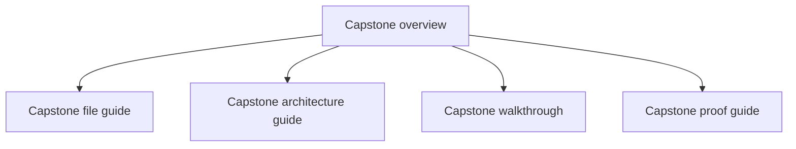
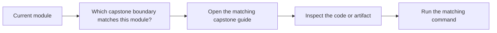

# Capstone Map

<!-- page-maps:start -->
## Page Maps

<!-- page-maps:end -->

This map turns the capstone into a deliberate study surface instead of a single long page.
Use it to decide where to go next when you want concrete proof for a course idea.

## Capstone route

- Start with [Capstone](capstone.md) for the overall purpose and domain.
- Read [Capstone File Guide](capstone-file-guide.md) when you need a code-reading route.
- Read [Capstone Review Checklist](capstone-review-checklist.md) when you want an explicit review lens.
- Read [Capstone Architecture Guide](capstone-architecture-guide.md) when you are reviewing ownership and boundaries.
- Read [Capstone Walkthrough](capstone-walkthrough.md) when you want the scenario flow from creation to incident publication.
- Read [Capstone Proof Guide](capstone-proof-guide.md) when you want the verification route.

## Module-to-capstone bridge

- Modules 01 to 03 map most directly to the aggregate, value objects, and lifecycle APIs.
- Modules 04 to 07 map most directly to events, projections, repositories, and runtime boundaries.
- Modules 08 to 10 map most directly to tests, public surfaces, review checklists, and operational inspection.

## Review question

At any point in the course, you should be able to answer: which capstone page shows the
same decision pressure as the chapter I am reading right now?
