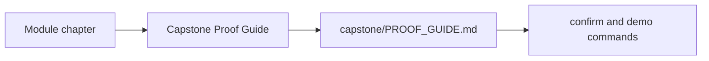
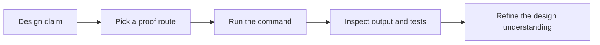

# Capstone Proof Guide

<!-- page-maps:start -->
## Page Maps

<!-- page-maps:end -->

Use this page when a chapter makes a design claim and you want the most direct executable
evidence in the capstone.

## Proof route

1. Read [capstone/PROOF_GUIDE.md](../capstone/PROOF_GUIDE.md).
2. Run `make confirm` for executable verification.
3. Run `make demo` for a human-readable scenario.
4. Use [Capstone Review Checklist](capstone-review-checklist.md) to decide whether the evidence is strong enough.

## What you should be able to answer after proof review

- Which object owns the checked behavior?
- Which output or assertion confirmed it?
- Which change would require a new or updated proof route?
