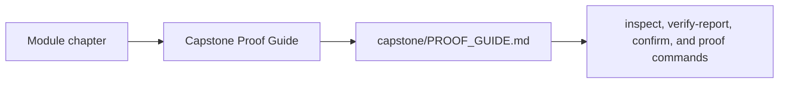
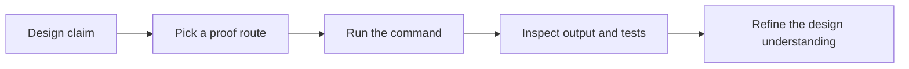

# Capstone Proof Guide

<!-- page-maps:start -->
## Page Maps

<!-- page-maps:end -->

Use this page when a chapter makes a design claim and you want the most direct executable
evidence in the capstone.

## Proof route

1. Read `capstone/PROOF_GUIDE.md`.
2. Run `make inspect` when you want the saved learner-facing snapshot before reading tests.
3. Run `make verify-report` when you want test output and learner-facing state in one review bundle.
4. Run `make confirm` when you want the strongest local confirmation route.
5. Run `make proof` when you want the sanctioned end-to-end route.
6. Use [Capstone Review Checklist](capstone-review-checklist.md) to decide whether the evidence is strong enough.

## What you should be able to answer after proof review

- Which object owns the checked behavior?
- Which output or assertion confirmed it?
- Which bundle or command is the best durable proof route for that claim?
- Which change would require a new or updated proof route?
