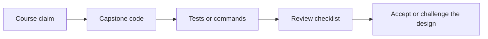
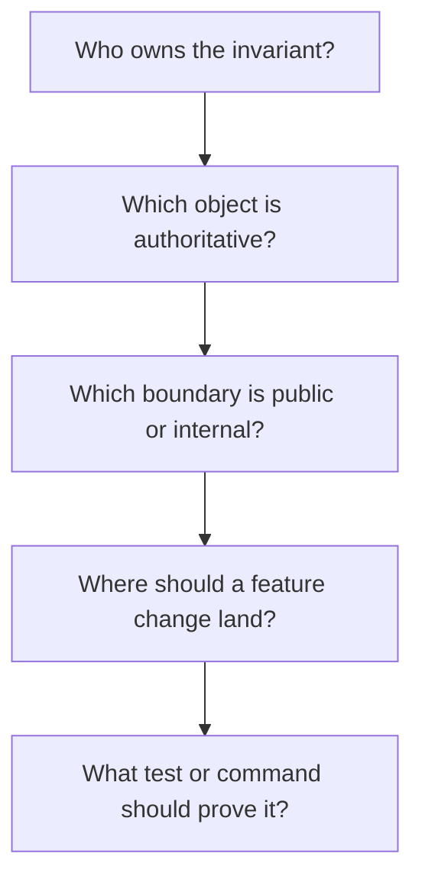

# Capstone Review Checklist

<!-- page-maps:start -->
## Page Maps

<!-- page-maps:end -->

Use this checklist when reviewing the capstone after a module or before extending it.

## Ownership

- Can you point to one clear owner for each invariant?
- Does the aggregate reject invalid lifecycle changes directly?
- Are evaluation rules encapsulated in policy objects instead of condition ladders?

## Authority

- Are read models and indexes derived from events instead of controlling domain state?
- Does the runtime coordinate work without owning domain rules?
- Is the repository a persistence boundary rather than a hidden source of business logic?

## Change safety

- If a new rule mode appears, is the extension seam obvious?
- If a new incident sink appears, can it stay outside the aggregate?
- If persistence changes, do domain invariants stay intact?

## Proof

- Which tests prove the current behavior?
- Which saved bundle shows the scenario clearly to a human reader?
- Which saved bundle captures executable verification for later review?
- Which file would you edit first for the change you are imagining?
- Which extension guide would stop you from placing that change in the wrong boundary?
