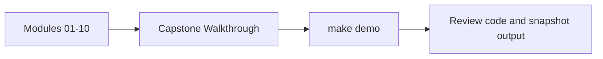
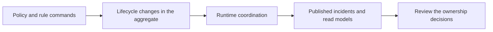

# Capstone Walkthrough

<!-- page-maps:start -->
## Page Maps

<!-- page-maps:end -->

Use this page when you want the capstone as a human story instead of as architecture
alone.

## Recommended route

1. Read `capstone/TOUR.md`.
2. Run `make demo` in the capstone directory.
3. Compare the printed cycle report and snapshot with the ownership claims in [Capstone Architecture Guide](capstone-architecture-guide.md).
4. Revisit the relevant module chapter if the flow feels surprising.

## What the walkthrough should teach

- how the learner-facing application surface differs from the lower-level runtime
- how rule lifecycle moves from draft to active before evaluation begins
- how alerts become events and derived read models
- how small object boundaries create a readable operational story
