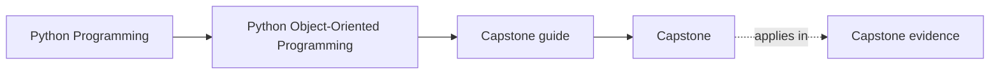
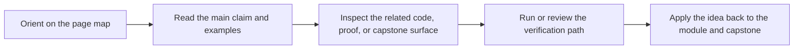
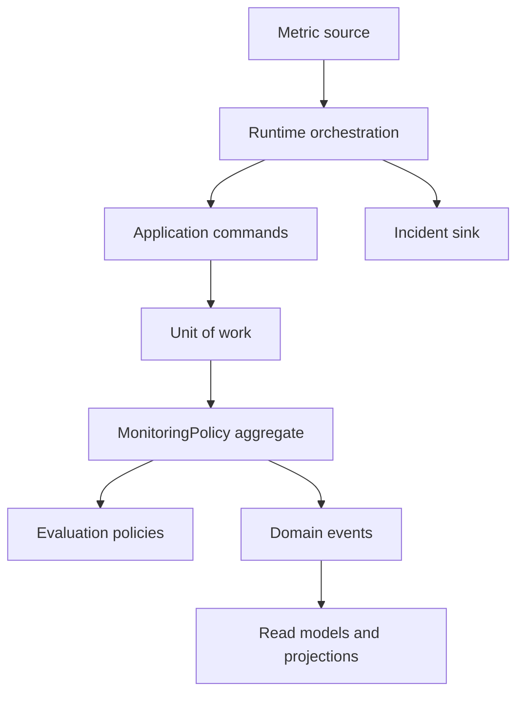

# Capstone


<!-- page-maps:start -->
## Page Maps




<!-- page-maps:end -->

The capstone is a monitoring-policy system for a team that needs to register rules,
activate them deliberately, evaluate incoming metric samples, emit incidents, and
keep downstream read models in sync without turning the domain model into a pile of
procedural glue.

This is the course's executable reference model. It is intentionally small enough to
read in one sitting, but rich enough to expose the object-oriented pressures the course
is teaching you to reason about.

## Study goal

Use the capstone to answer one question repeatedly:

> If I changed this behavior tomorrow, which object should absorb that change, and why?

If the course prose is working, the capstone should make those ownership decisions feel
clearer after each module.

## What the capstone demonstrates

- immutable value objects for metric names, samples, severities, and rule definitions
- a `MonitoringPolicy` aggregate root that owns registration, activation, retirement, and evaluation
- strategy objects for different rule-evaluation modes
- domain events that describe lifecycle changes and incidents without mutating projections directly
- projections and read models that stay downstream of authoritative events
- a runtime orchestration surface that coordinates adapters and commits without becoming the domain
- an explicit unit of work that makes rollback semantics visible instead of implicit

## How to use it while reading

- After Module 01, inspect the value objects and equality semantics.
- After Module 02, inspect the split between domain objects, policies, runtime orchestration, and adapters.
- After Module 03, inspect lifecycle states and validation boundaries.
- After Module 04, inspect aggregate ownership, events, and projections.
- After Module 05, inspect unit-of-work boundaries, failure handling, and extension pressure.
- After Module 06, inspect how repositories and codecs could persist the model without weakening invariants.
- After Module 07, inspect where clocks, schedulers, queues, and async adapters should sit relative to the aggregate.
- After Module 08, inspect whether the current tests prove contracts, lifecycles, and public behavior clearly enough.
- After Module 09, inspect which parts of the code should become the supported public facade and extension seam.
- After Module 10, review the whole capstone for hot paths, observability, trust boundaries, and operational readiness.

## Run it

From the repository root:

```bash
make PROGRAM=python-programming/python-object-oriented-programming test
```

From the capstone directory:

```bash
make confirm
```

Run the scenario walkthrough from the capstone directory:

```bash
make demo
```

## Architecture map



## What to look for in review

- Which object owns each invariant?
- Which objects are authoritative, and which are derived views?
- Which behavior is stable domain logic, and which is orchestration?
- Where would a new rule mode, new sink, or new read model be added?

## Where to start in code

If you want the most human-friendly entrypoint into the implementation, start with
`application.py`. It exposes the capstone as learner-facing use cases rather than as
raw internals, which makes it easier to connect the design prose to the executable flow.

## Why it matters

The capstone keeps the course honest. If a chapter claims that aggregates should own
invariants, that strategies should carry evaluation variability, or that projections
should stay downstream of events, the code here shows that shape directly and the tests
enforce it.
