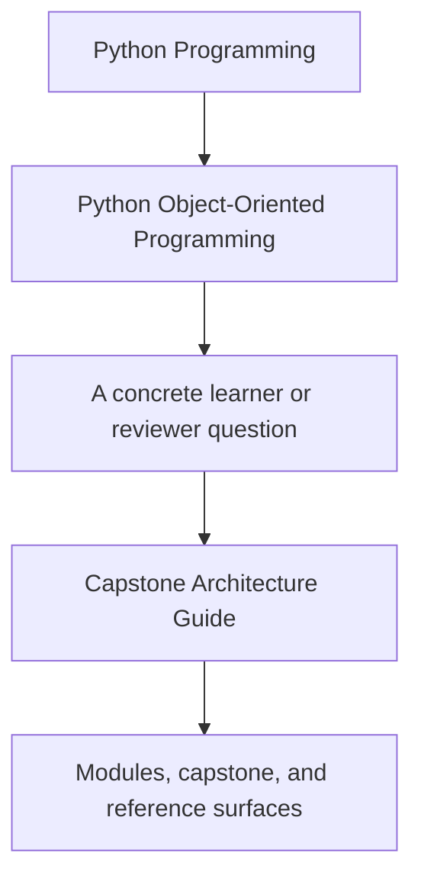
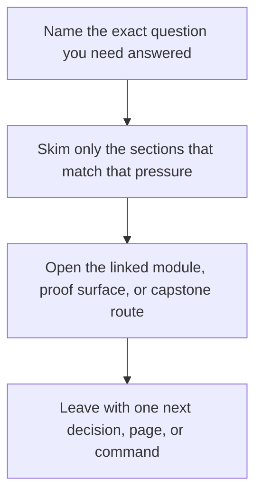

# Capstone Architecture Guide

<!-- page-maps:start -->
## Guide Fit

<!-- page-maps:end -->

Read the first diagram as a timing map: this guide is for a named pressure, not for wandering the whole course-book. Read the second diagram as the guide loop: arrive with a concrete question, use only the matching sections, then leave with one smaller and more honest next move.

Use this page when a module asks you to review the capstone's architecture instead of
only its syntax.

## What to inspect

1. Read [Capstone](index.md).
2. Compare it with [Capstone](index.md) and [Capstone File Guide](capstone-file-guide.md).
3. Inspect `application.py`, `model.py`, `runtime.py`, and `read_models.py` in that order.

## What the architecture should prove

- the aggregate owns lifecycle and invariant decisions
- orchestration stays outside the domain model
- replaceable policies carry evaluation variability
- projections derive views from events instead of controlling the model
- persistence and rollback concerns stay explicit

## Dependency direction to keep in mind

- learner-facing commands may pass through `application.py`, but they should not bypass aggregate ownership
- `runtime.py` may coordinate multiple boundaries, but it should depend on domain decisions rather than redefine them
- projections may depend on emitted events, but the aggregate should not depend on projection state
- repository and unit-of-work mechanics may serve the aggregate, but they should not hide business rules from review

## Question to boundary map

| If the review question is... | Start here | Then compare |
| --- | --- | --- |
| Who owns lifecycle and invariant decisions? | `model.py` | lifecycle tests and `ARCHITECTURE.md` |
| Where does variation belong without rewriting the aggregate? | `policies.py` | `model.py` and policy tests |
| What is orchestration versus domain logic? | `application.py` and `runtime.py` | walkthrough bundle and runtime tests |
| Which surfaces are authoritative and which are derived? | `read_models.py` and `projections.py` | events and aggregate transitions |
| Where would persistence or rollback change land? | `repository.py` | unit-of-work tests and architecture notes |

## Change-placement questions

- If a new rule mode appears, can it stay in `policies.py`?
- If a new integration or sink appears, can it stay outside `model.py`?
- If a new read model appears, can it derive from events instead of mutating authoritative state?
- If persistence changes, can the aggregate remain the owner of domain rules?

## Drift signals to catch early

- the runtime starts answering lifecycle questions that used to belong to the aggregate
- a projection becomes necessary to decide whether the aggregate may change
- a repository abstraction becomes the only place where a business rule is still visible
- a new evaluation mode cannot be added without widening `model.py` and `runtime.py` together

## Best use inside the course

- Use it after Module 04 to review aggregate and event boundaries.
- Revisit it after Modules 06 and 07 to confirm persistence and runtime pressure did not blur ownership.
- Revisit it again in Module 10 when reviewing observability and hardening choices.
