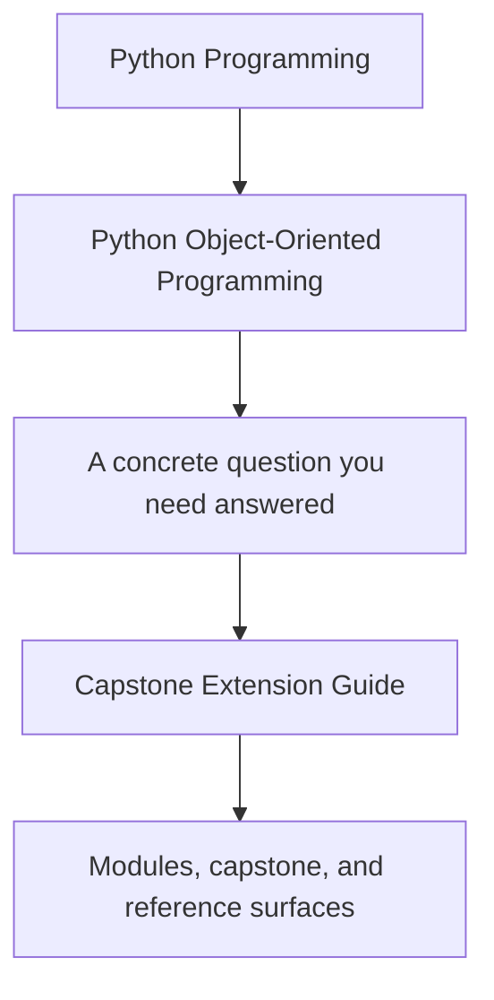
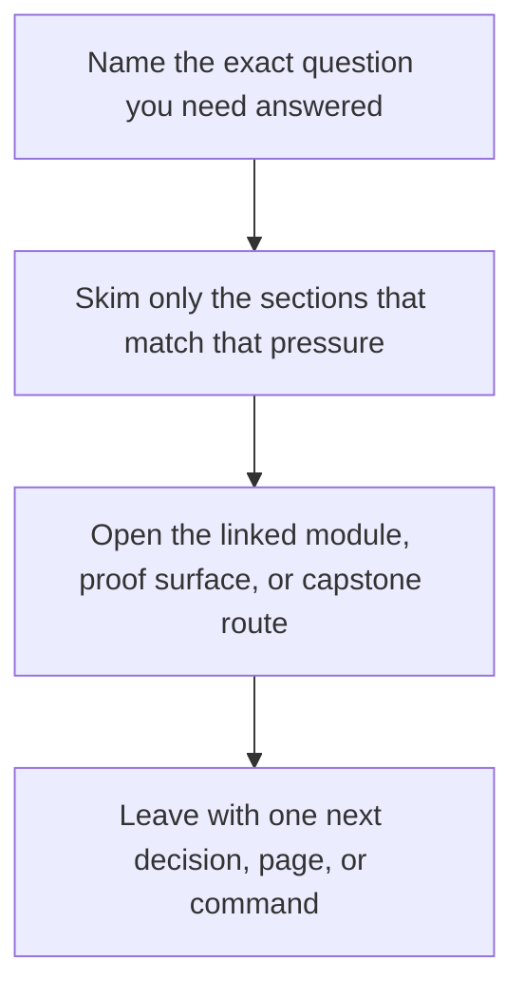

# Capstone Extension Guide

<!-- page-maps:start -->
## Guide Fit

<!-- page-maps:end -->

Read the first diagram as a timing map: this guide is for change pressure, not for
wandering the whole course-book. Read the second diagram as the guide loop: name the
change, place it at the smallest honest boundary, then prove it with the narrowest route
that still deserves trust.

Use this page before changing the capstone. The goal is not to freeze the repository.
The goal is to keep new work readable, bounded, and provable two years from now.

## Put the change in the right place

| If you are changing... | Start in... | Why |
| --- | --- | --- |
| lifecycle rules, invariant checks, or incident decisions | `src/service_monitoring/model.py` | the aggregate should stay authoritative for domain truth |
| variation in evaluation behavior | `src/service_monitoring/policies.py` | strategy differences belong outside condition ladders in the aggregate |
| application-level commands and use-case orchestration | `src/service_monitoring/application.py` | application flow should coordinate the domain rather than redefine it |
| repository or persistence mechanics | `src/service_monitoring/repository.py` | storage concerns should adapt to the model instead of deforming it |
| external delivery, clocks, or message sinks | `src/service_monitoring/runtime.py` or adapter modules | effectful boundaries should stay outside the model |
| projection or read-model changes | projection modules and downstream tests | derived views should remain downstream of domain events |

## Safe extensions

- adding a new policy object without weakening aggregate invariants
- adding a new sink or adapter without moving delivery logic into the domain
- clarifying a command or public route so the capstone is easier to review
- strengthening tests or saved proof bundles after a behavioral change

## Risky extensions

- teaching the aggregate about infrastructure concerns
- adding procedural branching where a policy or value object should absorb variation
- letting projections or repositories become authoritative
- changing public behavior without updating the named proof route that justifies it

## Minimum proof after a change

1. Run `make PROGRAM=python-programming/python-object-oriented-programming inspect`.
2. Run `make PROGRAM=python-programming/python-object-oriented-programming capstone-walkthrough`.
3. Run `make PROGRAM=python-programming/python-object-oriented-programming verify-report`.
4. Run `make PROGRAM=python-programming/python-object-oriented-programming proof` for
   larger ownership or extension changes.

If the new behavior becomes harder to place, explain, or prove after those routes, the
change likely weakened the capstone even if the code still runs.

## Review questions before you commit

- Which object or boundary owns the new behavior now?
- Which test or saved bundle would fail first if that ownership were wrong?
- Which future maintainer question became easier to answer?
- Would the filename, guide name, and commit message still make sense later?
