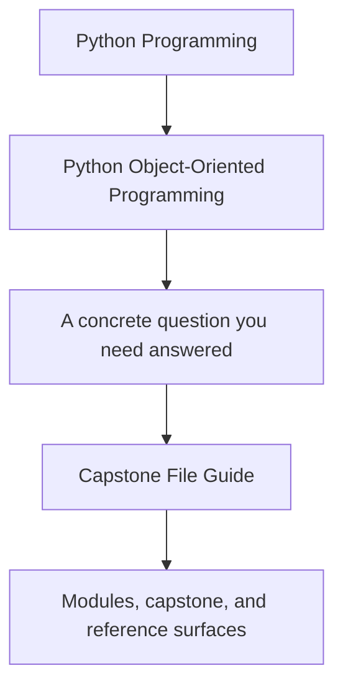
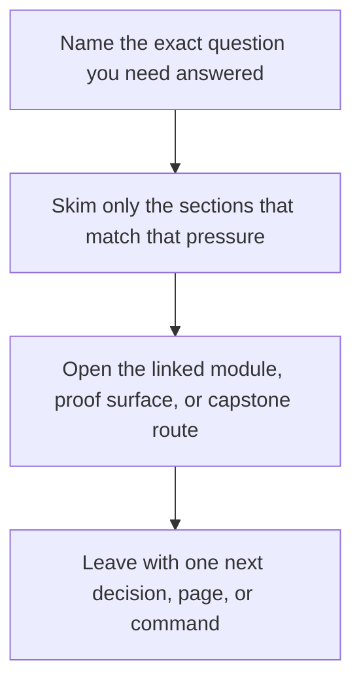

# Capstone File Guide

<!-- page-maps:start -->
## Guide Fit

<!-- page-maps:end -->

Read the first diagram as a timing map: this guide is for a named pressure, not for wandering the whole course-book. Read the second diagram as the guide loop: arrive with a concrete question, use only the matching sections, then leave with one smaller and more honest next move.

This guide gives the capstone a human reading order. The goal is not to read every file
alphabetically. The goal is to understand how the system is partitioned.

## Recommended reading order

1. `src/service_monitoring/application.py`
2. `src/service_monitoring/model.py`
3. `src/service_monitoring/policies.py`
4. `src/service_monitoring/runtime.py`
5. `src/service_monitoring/repository.py`
6. `src/service_monitoring/read_models.py`
7. `src/service_monitoring/projections.py`
8. `tests/`

## What each area is for

- `application.py` gives readable use cases and keeps the entry surface clear.
- `model.py` owns the aggregate, rule lifecycle, and domain invariants.
- `policies.py` owns replaceable evaluation behavior.
- `runtime.py` coordinates adapters, projections, and publication without becoming the domain.
- `repository.py` makes persistence and rollback intent explicit.
- `read_models.py` and `projections.py` model downstream views derived from authoritative events.
- `tests/` prove the course claims against behavior.

## Question to file map

| If the question is... | Start here | Then inspect |
| --- | --- | --- |
| Which object actually owns the rule lifecycle? | `model.py` | `tests/test_policy_lifecycle.py` |
| Where does evaluation variation belong? | `policies.py` | `tests/test_policy_evaluation.py` |
| What is public-facing versus internal orchestration? | `application.py` | `runtime.py` and `tests/test_application.py` |
| Where would persistence or rollback concerns land? | `repository.py` | `tests/test_unit_of_work.py` |
| Which views are derived instead of authoritative? | `read_models.py` and `projections.py` | `tests/test_runtime.py` |

## Matching local guides

- Read `PACKAGE_GUIDE.md` when you want the code layout at the package boundary.
- Read `TEST_GUIDE.md` when you want the fastest route from a claim to an executable check.
- Read `COMMAND_GUIDE.md` when you want the command-level review route.
- Read `PROOF_GUIDE.md` when you want the saved output route.
- Read `EXTENSION_GUIDE.md` when you want to place a new feature in the right boundary.

## Route by module stage

- Modules 01-03: focus on `model.py` and the lifecycle-focused tests.
- Modules 04-05: focus on `model.py`, `policies.py`, and `read_models.py`.
- Modules 06-07: focus on `repository.py`, `runtime.py`, and the runtime tests.
- Modules 08-10: start from `tests/`, bundles, and review guides before opening internals.

## What this order prevents

- starting in infrastructure and mistaking it for the core model
- treating projections as authoritative
- confusing orchestration with domain behavior
- missing where a new feature should land

## Common reading mistakes

- Starting with `runtime.py` and assuming the domain lives there.
- Treating tests as a final destination instead of a way to confirm file ownership claims.
- Reading projections before you know which events or aggregate rules they derive from.
