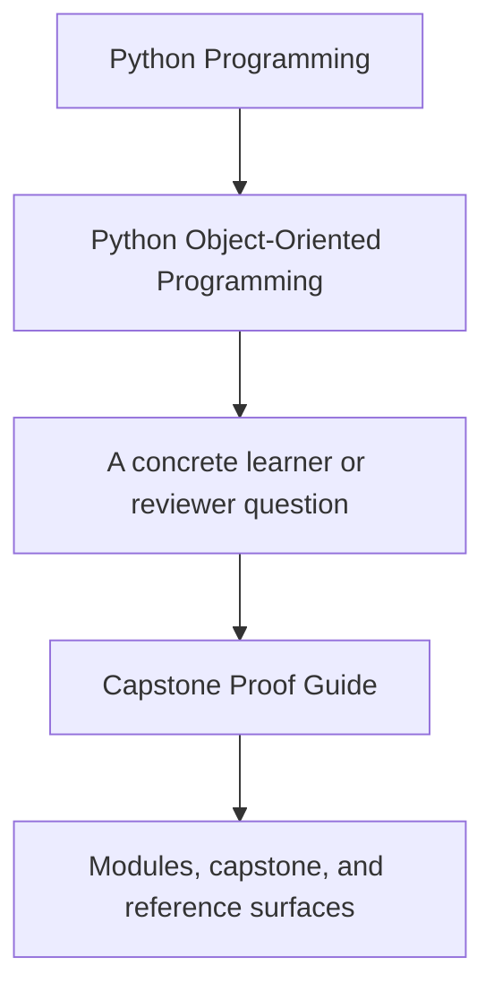
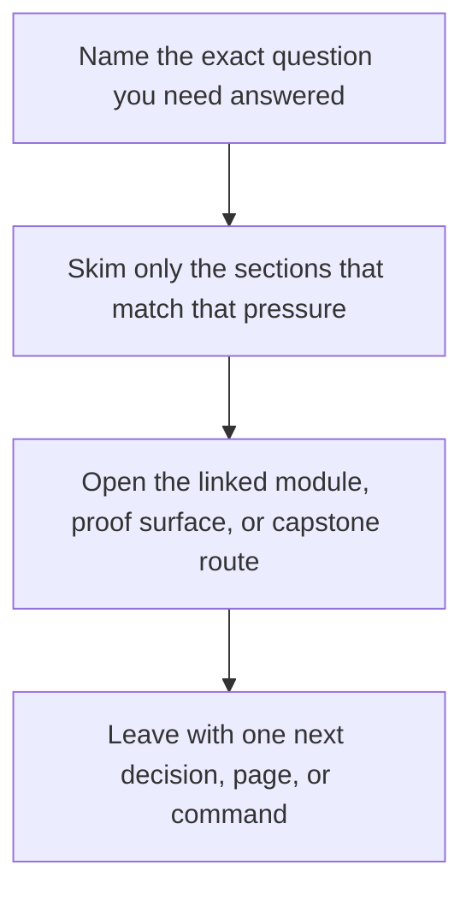

# Capstone Proof Guide

<!-- page-maps:start -->
## Guide Fit

<!-- page-maps:end -->

Read the first diagram as a timing map: this guide is for a named pressure, not for wandering the whole course-book. Read the second diagram as the guide loop: arrive with a concrete question, use only the matching sections, then leave with one smaller and more honest next move.

Use this page when a chapter makes a design claim and you want the most direct executable
evidence in the capstone.

## Proof route

1. Read [Capstone](index.md).
2. Run `make inspect` when you want the saved learner-facing snapshot before reading tests.
3. Run `make verify-report` when you want test output and learner-facing state in one review bundle.
4. Run `make confirm` when you want the strongest local confirmation route.
5. Run `make proof` when you want the sanctioned end-to-end route.
6. Use [Capstone Review Checklist](capstone-review-checklist.md) to decide whether the evidence is strong enough.

## Route selection rules

- choose `make inspect` when the main question is "what state or story should a learner see"
- choose `make tour` when the question is about sequence, walkthrough readability, or ownership across steps
- choose `make verify-report` when the question crosses tests and learner-facing state at the same time
- choose `make confirm` when a narrow claim has already been located and you need the strongest local bar
- choose `make proof` when you are reviewing the whole learner-facing evidence route, not only one behavior

## What you should be able to answer after proof review

- Which object owns the checked behavior?
- Which output or assertion confirmed it?
- Which bundle or command is the best durable proof route for that claim?
- Which change would require a new or updated proof route?

## Best proof route by module stage

- Modules 01-03: start with `make inspect` and lifecycle-oriented tests.
- Modules 04-07: prefer `make verify-report` when aggregate, repository, or runtime boundaries are the claim.
- Modules 08-10: use `make confirm` or `make proof` when the question is full-system trust rather than one narrow behavior.

## Claim to proof map

| If the claim is about... | Inspect first | Best proof route |
| --- | --- | --- |
| value semantics, lifecycle rules, or aggregate ownership | `tests/test_policy_lifecycle.py` | `make inspect` |
| replaceable evaluation behavior | `tests/test_policy_evaluation.py` | `make verify-report` |
| runtime orchestration versus domain ownership | `tests/test_runtime.py` and `application.py` | `make tour` or `make verify-report` |
| public learner-facing behavior | `tests/test_application.py` and `tests/test_demo.py` | `make inspect` or `make tour` |
| full-system trust and saved executable evidence | saved verification bundle plus `PROOF_GUIDE.md` | `make confirm` or `make proof` |

## Smallest honest proof by question

- If the question is architectural, start with guides and targeted tests before `confirm`.
- If the question is behavioral, start with the smallest saved bundle or test that exercises the claimed behavior.
- If the question is course-level trust, escalate to `make proof` only after the narrower claims are already clear.

## Signs you picked the wrong route

- the command finished, but you still cannot name the owning object
- the saved bundle looks useful, but it does not touch the claim you care about
- the route proves several things at once and leaves the original question blurrier
- you reached for `make proof` mainly because the narrower route felt mentally uncomfortable
