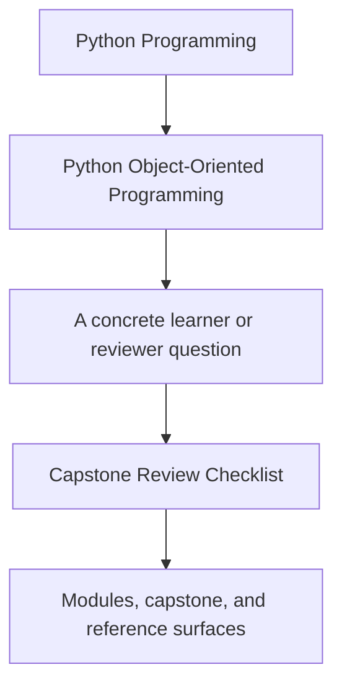
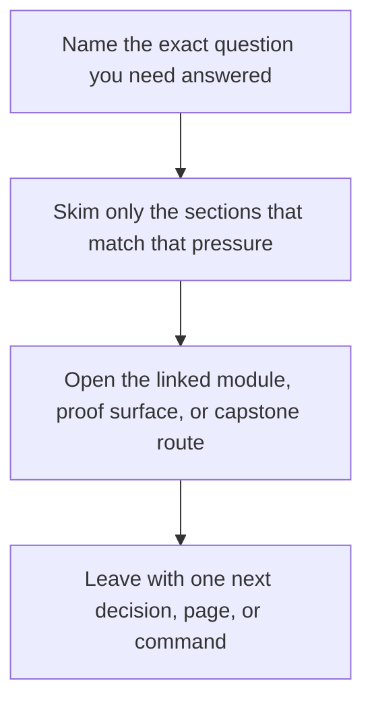

# Capstone Review Checklist

<!-- page-maps:start -->
## Guide Fit

<!-- page-maps:end -->

Read the first diagram as a timing map: this guide is for a named pressure, not for wandering the whole course-book. Read the second diagram as the guide loop: arrive with a concrete question, use only the matching sections, then leave with one smaller and more honest next move.

Use this checklist when reviewing the capstone after a module or before extending it.

## Ownership

- Can you point to one clear owner for each invariant?
- Does the aggregate reject invalid lifecycle changes directly?
- Are evaluation rules encapsulated in policy objects instead of condition ladders?

## Authority

- Are read models and indexes derived from events instead of controlling domain state?
- Does the runtime coordinate work without owning domain rules?
- Is the repository a persistence boundary rather than a hidden source of business logic?

## Change safety

- If a new rule mode appears, is the extension seam obvious?
- If a new incident sink appears, can it stay outside the aggregate?
- If persistence changes, do domain invariants stay intact?

## Proof

- Which tests prove the current behavior?
- Which saved bundle shows the scenario clearly to a human reader?
- Which saved bundle captures executable verification for later review?
- Which file would you edit first for the change you are imagining?
- Which extension guide would stop you from placing that change in the wrong boundary?

## Red flags

- The runtime starts owning lifecycle decisions that should stay in the aggregate.
- Read models or projections begin mutating authoritative state directly.
- New evaluation behavior lands in the aggregate as condition ladders instead of policy surfaces.
- Persistence concerns start redefining the domain model instead of adapting to it.
- A reviewer can no longer name the smallest test or bundle that proves a claim.

## Evidence prompts

- If you changed this boundary tomorrow, which test should fail first?
- Which saved bundle would let another reviewer understand the claim without rerunning commands?
- Which guide would you open before editing the file you have in mind?
- Which object would become suspicious first if the design drifted toward procedural glue?

## Module-stage prompts

- Modules 01-03: Which value or lifecycle rule becomes false first if the model drifts?
- Modules 04-07: Which boundary is authoritative once multiple objects, repositories, or runtime adapters are involved?
- Modules 08-10: Which public bundle or command best proves the current design to another reviewer?
