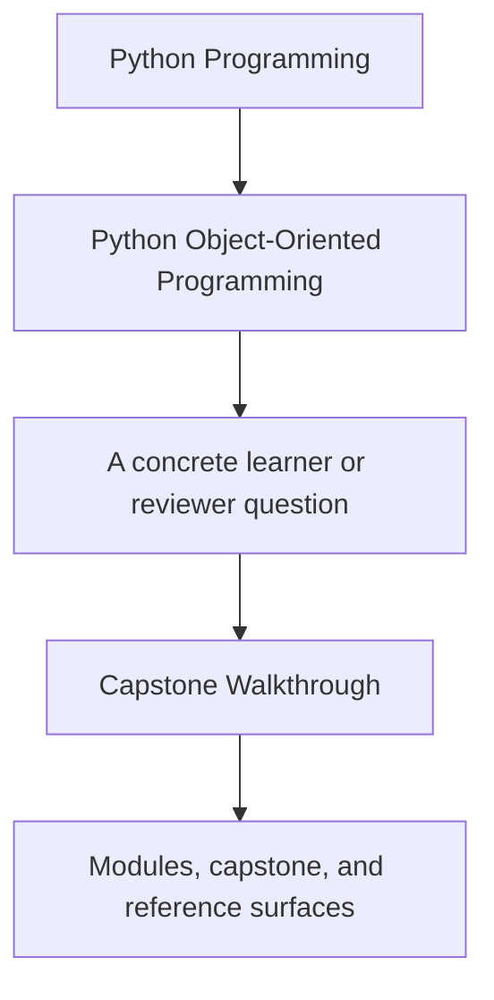
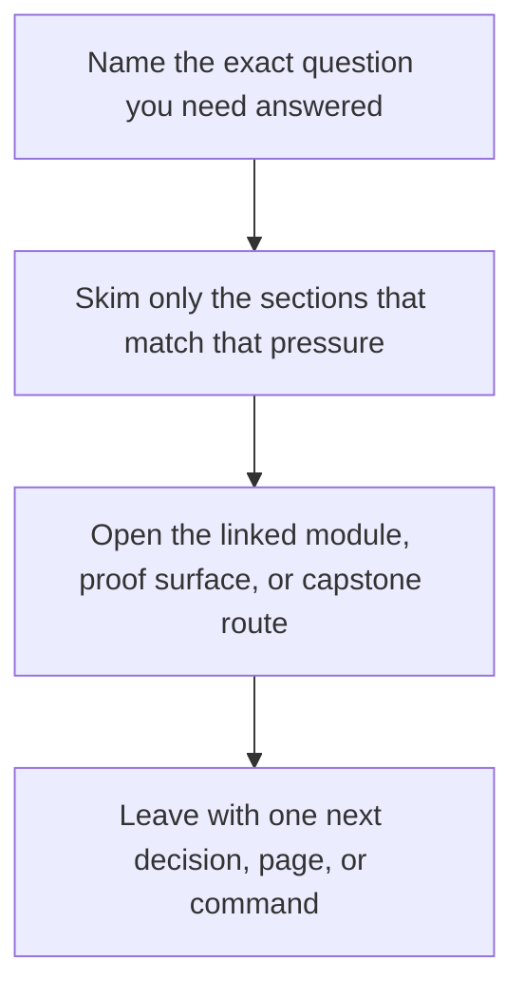

# Capstone Walkthrough

<!-- page-maps:start -->
## Guide Fit

<!-- page-maps:end -->

Read the first diagram as a timing map: this guide is for a named pressure, not for wandering the whole course-book. Read the second diagram as the guide loop: arrive with a concrete question, use only the matching sections, then leave with one smaller and more honest next move.

Use this page when you want the capstone as a human story instead of as architecture
alone.

## Recommended route

1. Read `capstone/TOUR.md`.
2. Run `make tour` in the capstone directory, or `make PROGRAM=python-programming/python-object-oriented-programming capstone-tour` from the repository root.
3. Read the saved `walkthrough.txt` output before diving into internals.
4. Compare the walkthrough bundle with the ownership claims in [Capstone Architecture Guide](capstone-architecture-guide.md).
5. Revisit the relevant module chapter if the flow feels surprising.

## What the walkthrough should teach

- how the learner-facing application surface differs from the lower-level runtime
- how rule lifecycle moves from draft to active before evaluation begins
- how alerts become events and derived read models
- how small object boundaries create a readable operational story
- how the walkthrough bundle gives you a review surface you can revisit without rerunning ad hoc commands

## Scenario-stage map

| Stage in the walkthrough | Main boundary to notice | Why it matters |
| --- | --- | --- |
| policy creation | `application.py` into `model.py` | the learner-facing facade should not own the domain rules |
| rule activation | aggregate lifecycle rules | invalid transitions should fail at the authoritative boundary |
| sample evaluation | `policies.py` plus aggregate coordination | evaluation variability should not turn into condition ladders inside the aggregate |
| alert publication | runtime orchestration and sink boundary | integration work should stay outside the domain model |
| read-model update | projections and derived views | downstream views must not become the source of truth |

## What to compare after the walkthrough

- Compare the walkthrough bundle with `ARCHITECTURE.md` to see whether the story and the boundary design agree.
- Compare the walkthrough bundle with the relevant tests if one stage still feels magical.
- Revisit the matching module chapter only after you can name which stage of the scenario felt unclear.
