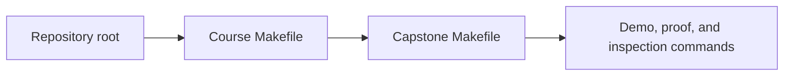
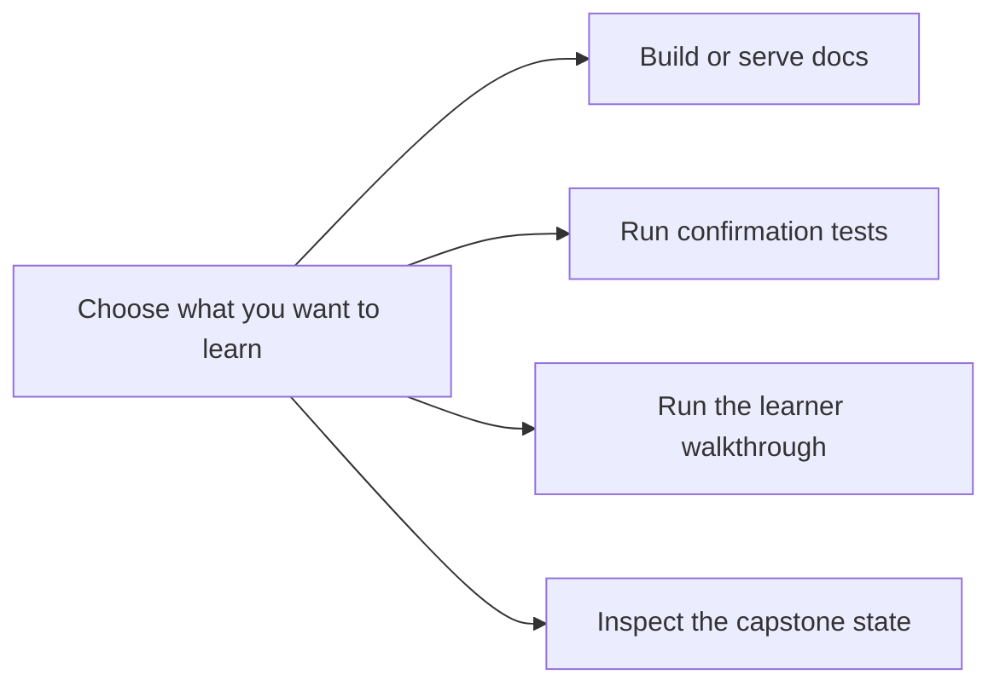

# Command Guide


<!-- page-maps:start -->
## Page Maps




<!-- page-maps:end -->

This page exists so the learner does not have to reverse-engineer the executable surface.
Use it whenever you want to connect course claims to runnable evidence.

## Stable commands from the repository root

```bash
make PROGRAM=python-programming/python-object-oriented-programming docs-serve
make PROGRAM=python-programming/python-object-oriented-programming docs-build
make PROGRAM=python-programming/python-object-oriented-programming test
make PROGRAM=python-programming/python-object-oriented-programming demo
make PROGRAM=python-programming/python-object-oriented-programming inspect
make PROGRAM=python-programming/python-object-oriented-programming proof
```

## Stable commands from the capstone directory

```bash
make confirm
make demo
make inspect-summary
make inspect-rules
make inspect-history
make proof
```

## How to choose the right command

- Use `docs-serve` when you are reading and want the course-book locally.
- Use `test` or `confirm` when you want executable confidence in the capstone.
- Use `demo` when you want a human-readable walkthrough of the monitoring scenario.
- Use `inspect` or the capstone inspection targets when you want the learner-facing snapshot without reading raw internals.
- Use `proof` when you want the full course-sanctioned evidence route in one command.

## Honest rule

If a course claim matters, there should be a command or test route that helps you inspect
it. If you cannot name that route, use the capstone pages and module maps to find the
right surface before moving on.
