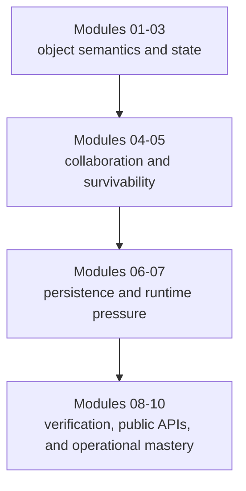

# Course Guide

<!-- page-maps:start -->
## Page Maps

<!-- page-maps:end -->

This guide explains how the course is shaped and why the sequence matters. The course is
not a pile of OOP topics. It is a pressure-tested path from object semantics to systems
that survive integration, change, and operational stress.

## The three arcs

## Semantic floor

Modules 01 to 03 establish the language of the course:

- what an object means in Python
- how equality, identity, and mutation interact
- how lifecycles and typestate affect design

Without this floor, later architecture advice turns into memorized slogans.

## Collaboration and evolution

Modules 04 to 07 move from single objects to systems:

- aggregates and cross-object invariants
- projections, events, and orchestration
- persistence and schema change
- time, scheduling, retries, and concurrency boundaries

This is where many OOP courses become hand-wavy. This course tries to stay concrete.

## Confidence and governance

Modules 08 to 10 ask whether the model can be trusted:

- do tests prove the real contracts
- does the public API reflect the intended boundary
- can the system be observed, hardened, and evolved safely

## How to use the capstone during the arc

- Treat Modules 01 to 03 as preparation for understanding the capstone's core objects.
- Treat Modules 04 to 07 as the explanation for the capstone's shape.
- Treat Modules 08 to 10 as the audit of whether that shape deserves confidence.

## Honest expectation

If you rush, the course will feel heavier than necessary. If you read it in order and
keep the capstone in view, the later modules should feel like consequences of earlier
ownership decisions instead of unrelated advanced topics.
