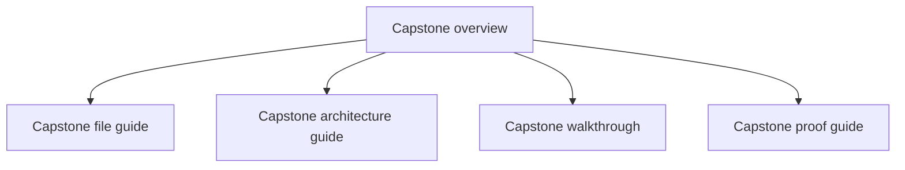
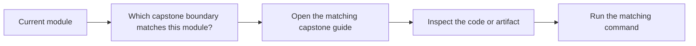

# Capstone Map

<!-- page-maps:start -->
## Page Maps

<!-- page-maps:end -->

This map turns the capstone into a deliberate study surface instead of a single long page.
Use it to decide where to go next when you want concrete proof for a course idea.

## Capstone route

- Start with [Capstone](capstone.md) for the overall purpose and domain.
- Read [Capstone File Guide](capstone-file-guide.md) when you need a code-reading route.
- Read [Capstone Review Checklist](capstone-review-checklist.md) when you want an explicit review lens.
- Read [Capstone Architecture Guide](capstone-architecture-guide.md) when you are reviewing ownership and boundaries.
- Read [Capstone Walkthrough](capstone-walkthrough.md) when you want the scenario flow from creation to incident publication.
- Read [Capstone Proof Guide](capstone-proof-guide.md) when you want the verification route.
- Use the local capstone guides `COURSE_STAGE_MAP.md`, `PACKAGE_GUIDE.md`, `TEST_GUIDE.md`, `TARGET_GUIDE.md`, `INSPECTION_GUIDE.md`, and `EXTENSION_GUIDE.md` when you need a narrower review surface.

## Module-to-capstone bridge

| Module | Inspect this first | Best guide | Strongest matching proof route |
| --- | --- | --- | --- |
| Module 01 | `src/service_monitoring/model.py` | [Capstone File Guide](capstone-file-guide.md) | `make inspect` |
| Module 02 | `src/service_monitoring/model.py` and `src/service_monitoring/application.py` | [Capstone Architecture Guide](capstone-architecture-guide.md) | `make tour` |
| Module 03 | lifecycle rules in `src/service_monitoring/model.py` | [Capstone Review Checklist](capstone-review-checklist.md) | `make inspect` |
| Module 04 | aggregate events and read-model flow | [Capstone Architecture Guide](capstone-architecture-guide.md) | `make verify-report` |
| Module 05 | `src/service_monitoring/runtime.py` and unit-of-work surfaces | [Capstone Walkthrough](capstone-walkthrough.md) | `make tour` |
| Module 06 | `src/service_monitoring/repository.py` | [Capstone File Guide](capstone-file-guide.md) | `make verify-report` |
| Module 07 | runtime coordination and tests | [Capstone Proof Guide](capstone-proof-guide.md) | `make verify-report` |
| Module 08 | `tests/` and saved proof bundles | [Capstone Proof Guide](capstone-proof-guide.md) | `make confirm` |
| Module 09 | public entry surfaces and extension seams | [Capstone Review Checklist](capstone-review-checklist.md) | `make proof` |
| Module 10 | full review bundle and architecture surfaces | [Capstone Proof Guide](capstone-proof-guide.md) | `make proof` |

## How to use the bridge

1. Start from the module you are reading.
2. Inspect the named file or surface first.
3. Open the matching guide only after the boundary is visible.
4. Run the smallest proof route that confirms the current claim.

## Review question

At any point in the course, you should be able to answer: which capstone page shows the
same decision pressure as the chapter I am reading right now, and which local command or
bundle proves it?
