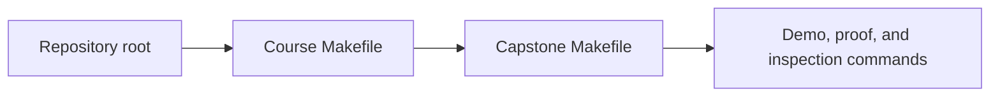
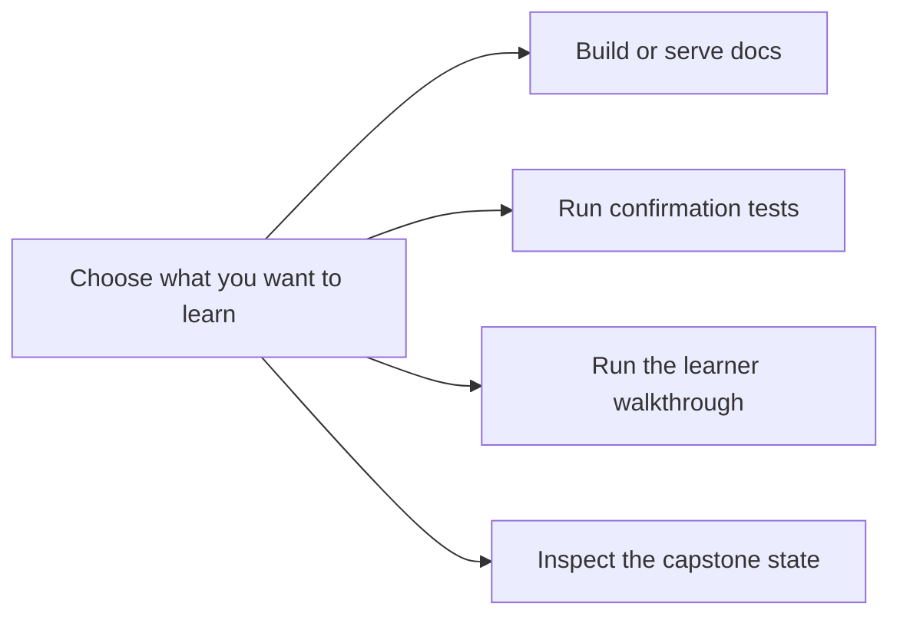

# Command Guide


<!-- page-maps:start -->
## Page Maps




<!-- page-maps:end -->

This page exists so the learner does not have to reverse-engineer the executable surface.
Use it whenever you want to connect course claims to runnable evidence.

## Stable commands from the repository root

```bash
make PROGRAM=python-programming/python-object-oriented-programming docs-serve
make PROGRAM=python-programming/python-object-oriented-programming docs-build
make PROGRAM=python-programming/python-object-oriented-programming test
make PROGRAM=python-programming/python-object-oriented-programming demo
make PROGRAM=python-programming/python-object-oriented-programming inspect
make PROGRAM=python-programming/python-object-oriented-programming capstone-tour
make PROGRAM=python-programming/python-object-oriented-programming capstone-verify-report
make PROGRAM=python-programming/python-object-oriented-programming capstone-confirm
make PROGRAM=python-programming/python-object-oriented-programming proof
```

## Stable commands from the capstone directory

```bash
make confirm
make demo
make inspect
make tour
make verify-report
make proof
```

## How to choose the right command

- Use `docs-serve` when you are reading and want the course-book locally.
- Use `test` when you want the raw executable suite without the review bundles.
- Use `demo` when you want the walkthrough printed directly in the terminal.
- Use `inspect` when you want a saved learner-facing inspection bundle with scenario, rules, and history outputs.
- Use `capstone-tour` or `tour` when you want the saved walkthrough bundle for review or sharing.
- Use `capstone-verify-report` or `verify-report` when you want test output and learner-facing state captured together.
- Use `capstone-confirm` or `confirm` when you want the strongest program-approved confirmation route.
- Use `proof` when you want the full course-sanctioned evidence route in one command.

## Route by learner goal

| If you want to... | Start with | Escalate to |
| --- | --- | --- |
| understand the capstone story without reading internals first | `demo` | `capstone-tour` |
| inspect saved learner-facing state | `inspect` | `capstone-verify-report` |
| run raw executable checks quickly | `test` | `capstone-confirm` |
| review architecture with durable evidence | `capstone-tour` | `capstone-verify-report` |
| run the strongest course-approved confirmation route | `capstone-confirm` | `proof` |

## Smallest honest command

- If the question is narrative, start with `demo` or `capstone-tour`.
- If the question is behavioral, start with `test` or `inspect`.
- If the question is whole-capstone trust, start with `capstone-confirm` and escalate to `proof` only when you need the full learner-facing route.

## Honest rule

If a course claim matters, there should be a command or test route that helps you inspect
it. If you cannot name that route, use the capstone pages, local guide files, and module
maps to find the right surface before moving on.
