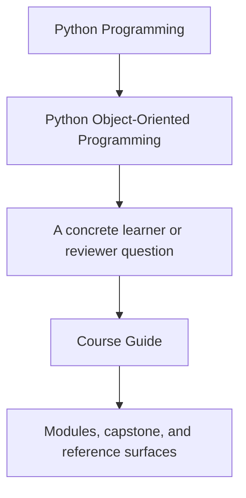
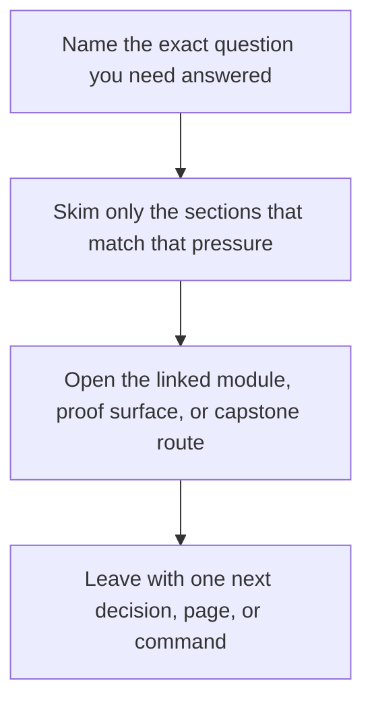

# Course Guide

<!-- page-maps:start -->
## Guide Fit

<!-- page-maps:end -->

Read the first diagram as a timing map: this guide is for a named pressure, not for wandering the whole course-book. Read the second diagram as the guide loop: arrive with a concrete question, use only the matching sections, then leave with one smaller and more honest next move.

This guide explains how the course is shaped and why the sequence matters. The course is
not a pile of OOP topics. It is a pressure-tested path from object semantics to systems
that survive integration, change, and operational stress.

## Course Spine

The course has four linked layers:

1. entry pages and orientation
2. module work from object semantics to operational hardening
3. capstone proof in one executable system
4. review surfaces for ownership, trust, and public-boundary decisions

## The Three Arcs

### Semantic floor

Modules 01 to 03 establish the language of the course:

- what an object means in Python
- how equality, identity, and mutation interact
- how lifecycles and typestate affect design

Without this floor, later architecture advice turns into memorized slogans.

### Collaboration and evolution

Modules 04 to 07 move from single objects to systems:

- aggregates and cross-object invariants
- projections, events, and orchestration
- persistence and schema change
- time, scheduling, retries, and concurrency boundaries

This is where many OOP courses become hand-wavy. This course tries to stay concrete.

### Confidence and governance

Modules 08 to 10 ask whether the model can be trusted:

- do tests prove the real contracts
- does the public API reflect the intended boundary
- can the system be observed, hardened, and evolved safely

## How The Capstone Fits

- Treat Modules 01 to 03 as preparation for understanding the capstone's core objects.
- Treat Modules 04 to 07 as the explanation for the capstone's shape.
- Treat Modules 08 to 10 as the audit of whether that shape deserves confidence.

## Route by learner state

- If object semantics still feel slippery, stay with Modules 01 to 03 before you escalate into architecture advice.
- If your real problem is collaboration or persistence drift, start with [Pressure Routes](pressure-routes.md) and then come back to the relevant arc here.
- If you are reviewing an existing design, keep [Module Checkpoints](module-checkpoints.md) and [Capstone Map](../capstone/capstone-map.md) open so each module stays tied to a concrete proof surface.
- If you only need the course shape before reading, use [Course Map](../module-00-orientation/course-map.md) instead of holding the whole sequence in memory.

## Support Pages To Keep Open

- [Proof Matrix](proof-matrix.md) when you want the course promises tied directly to evidence
- [Pressure Routes](pressure-routes.md) when the design question is clearer than the module name
- [Module Promise Map](module-promise-map.md) when you want the module titles translated into explicit learner contracts
- [Module Checkpoints](module-checkpoints.md) when you need a module-end exit bar
- [Module Dependency Map](module-dependency-map.md) when the reading order needs justification
- [Practice Map](practice-map.md) when you want the module-to-proof loop in one place
- [Pressure Routes](pressure-routes.md) when the next useful module depends on the design pressure you are under
- [Proof Ladder](proof-ladder.md) when you need to size proof correctly
- [Capstone](../capstone/index.md) and [Capstone Map](../capstone/capstone-map.md) when you want the repository route kept explicit

## Honest Expectation

If you rush, the course will feel heavier than necessary. If you read it in order and
keep the capstone in view, the later modules should feel like consequences of earlier
ownership decisions instead of unrelated advanced topics.
