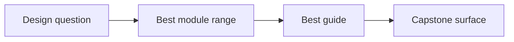
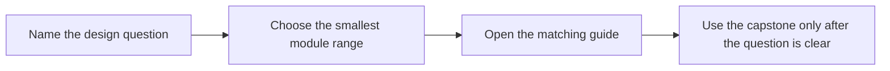

# Design Question Map

<!-- page-maps:start -->
## Page Maps

<!-- page-maps:end -->

Use this page when the learner problem is easier to name than the module that teaches it.

## Question to route table

| If the question is... | Start with | Keep this guide open | Capstone cross-check |
| --- | --- | --- | --- |
| What kind of object is this, and what contract should it carry? | Modules 01-03 | [Module Promise Map](module-promise-map.md) | model and lifecycle tests |
| Should this be a value object, entity, service, or policy? | Module 02 | [Pressure Routes](pressure-routes.md) | domain objects, policies, and adapters |
| How do I stop illegal states from leaking through? | Module 03 | [Module Checkpoints](module-checkpoints.md) | lifecycle APIs and validation surfaces |
| Which object should own a cross-object invariant? | Module 04 | [Capstone Architecture Guide](capstone-architecture-guide.md) | aggregate root, events, and projections |
| Where should retries, cleanup, or recovery behavior live? | Module 05 | [Pressure Routes](pressure-routes.md) | runtime facade and unit-of-work boundary |
| How do I add persistence without flattening the model? | Module 06 | [Capstone File Guide](capstone-file-guide.md) | repository and projection boundaries |
| How do clocks, queues, or async work without corrupting ownership? | Module 07 | [Proof Ladder](proof-ladder.md) | runtime coordination and tests |
| Do the tests actually prove the intended contracts? | Module 08 | [Capstone Proof Guide](capstone-proof-guide.md) | test suite and saved review bundles |
| What should be public, internal, or extensible? | Module 09 | [Capstone Review Checklist](capstone-review-checklist.md) | facade and extension seams |
| Is this design operationally trustworthy? | Module 10 | [Proof Ladder](proof-ladder.md) | inspect, verify-report, confirm, and proof routes |

## How to use it

1. Name the design question in one sentence.
2. Start with the smallest module range that answers that question.
3. Keep one guide open so the route and exit bar stay visible.
4. Use the capstone only after you can say what you are trying to confirm.
