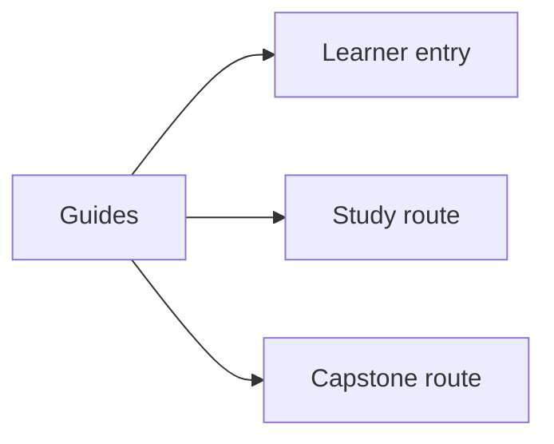
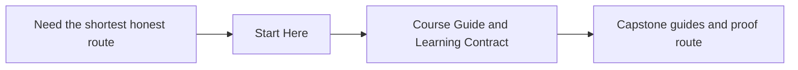

# Guides

<!-- page-maps:start -->
## Page Maps

<!-- page-maps:end -->

Use this section when you need route guidance rather than one module chapter. These
pages keep the reading order, practice rhythm, and capstone bridge explicit so the
module tree can stay focused on long-lived content.

## Read These First

- [Start Here](start-here.md) for the shortest honest entry route
- [Course Guide](course-guide.md) for the module arc and support-page roles
- [Learning Contract](learning-contract.md) for the teaching bar and proof expectations
- [Orientation](../module-00-orientation/index.md) for the full course shape
- [Course Map](../module-00-orientation/course-map.md) for the reading structure

## Use These For Study Planning

- [Design Question Map](design-question-map.md) when you know the design problem faster than the module name
- [Module Promise Map](module-promise-map.md) when you want each module title translated into a learner contract
- [Module Checkpoints](module-checkpoints.md) when you need a module-end exit bar
- [Study Routes](study-routes.md) when you need a session-sized reading plan
- [Systems Route](systems-route.md) when you want the heavier second half of the course treated as one design arc
- [Pressure Routes](pressure-routes.md) when your route is shaped by a concrete design or review problem
- [Module Dependency Map](module-dependency-map.md) and [Practice Map](practice-map.md) when you need the sequence and rehearsal loop explained

## Use These For Commands And Proof

- [Command Guide](command-guide.md) for the executable route
- [Proof Ladder](proof-ladder.md) for choosing the smallest honest proof route
- [Object Design Checklist](../reference/object-design-checklist.md) and [Boundary Review Prompts](../reference/boundary-review-prompts.md) for stable review bars

## Use These For Capstone Reading

- [Capstone](capstone.md) for the capstone’s role in the course
- [Capstone Map](capstone-map.md) for the module-to-repository route
- [Capstone File Guide](capstone-file-guide.md) for the capstone reading path
- [Capstone Review Checklist](capstone-review-checklist.md) for a bounded review pass
- [Capstone Architecture Guide](capstone-architecture-guide.md) for boundary ownership
- [Capstone Walkthrough](capstone-walkthrough.md) for the human review story
- [Capstone Proof Guide](capstone-proof-guide.md) for verification depth

## Keep The Layout Stable

- `index.md` stays the course home
- `guides/` stays the learner route and proof shelf
- `reference/` stays the durable review shelf
- `module-00-orientation/` plus Modules `01` to `10` stay the teaching arc
