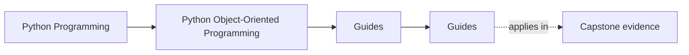
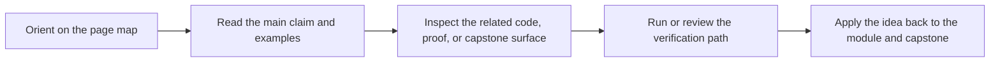

# Guides

<!-- page-maps:start -->
## Page Maps

<!-- page-maps:end -->

Read the first diagram as a timing map: this guide is for a named pressure, not for wandering the whole course-book. Read the second diagram as the guide loop: arrive with a concrete question, use only the matching sections, then leave with one smaller and more honest next move.

Use this section when you need route guidance rather than one module chapter. These
pages keep the reading order, practice rhythm, and capstone bridge explicit so the
module tree can stay focused on long-lived content.

## Choose one lane

| If your pressure is... | Best page | Then go to... |
| --- | --- | --- |
| I need the shortest honest entry route. | [Start Here](start-here.md) | [Course Guide](course-guide.md) |
| I need the module arc and proof bar kept explicit. | [Course Guide](course-guide.md) | [Learning Contract](learning-contract.md) |
| I know the design pressure faster than the module name. | [Pressure Routes](pressure-routes.md) | [Proof Matrix](proof-matrix.md) |
| I need to know what each module is supposed to change. | [Module Promise Map](module-promise-map.md) | [Module Checkpoints](module-checkpoints.md) |
| I need the route from promise to evidence. | [Proof Matrix](proof-matrix.md) | [Proof Ladder](proof-ladder.md) |
| The capstone still feels unfamiliar. | [Start Here](start-here.md) | [Capstone](../capstone/index.md) |
| I am resuming after a break. | [Mid-Course Map](../module-00-orientation/mid-course-map.md) | [Proof Ladder](proof-ladder.md) |

## Use the shelf by job

| Job | Best page |
| --- | --- |
| understand the module arc and support-page roles | [Course Guide](course-guide.md) |
| see the sequence justified | [Module Dependency Map](../reference/module-dependency-map.md) |
| rehearse the module-to-proof loop | [Practice Map](../reference/practice-map.md) |
| hold the stable review bar steady | [Review Checklist](../reference/review-checklist.md) |
| sharpen a keep, change, or reject decision | [Boundary Review Prompts](../reference/boundary-review-prompts.md) |
| check your own understanding before escalating | [Self-Review Prompts](../reference/self-review-prompts.md) |
| route a claim to executable evidence | [Proof Matrix](proof-matrix.md) |
| choose the smallest honest proof route | [Proof Ladder](proof-ladder.md) |
| confirm the local environment before public commands | [Platform Setup](platform-setup.md) |

## Cross into the capstone deliberately

| If you need... | Best page |
| --- | --- |
| the capstone's role in the course | [Capstone](../capstone/index.md) |
| the module-to-repository route | [Capstone Map](../capstone/capstone-map.md) |
| a bounded first pass through the repository | [Capstone Walkthrough](../capstone/capstone-walkthrough.md) |
| the capstone reading path by file | [Capstone File Guide](../capstone/capstone-file-guide.md) |
| boundary ownership inside the system | [Capstone Architecture Guide](../capstone/capstone-architecture-guide.md) |
| verification depth and saved proof | [Capstone Proof Guide](../capstone/capstone-proof-guide.md) |
| a bounded review pass | [Capstone Review Worksheet](../capstone/capstone-review-worksheet.md) |
| safe extension | [Capstone Extension Guide](../capstone/capstone-extension-guide.md) |

## Keep The Layout Stable

- `index.md` stays the course home
- `guides/` stays the reading route and proof shelf
- `capstone/` stays the capstone-specific reading, proof, and review shelf
- `reference/` stays the durable review shelf
- `module-00-orientation/` plus Modules `01` to `10` stay the course arc

## Directory glossary

Use [Glossary](../reference/glossary.md) when you want the recurring language in this shelf kept stable while you move between study routes, proof routes, and support pages.
