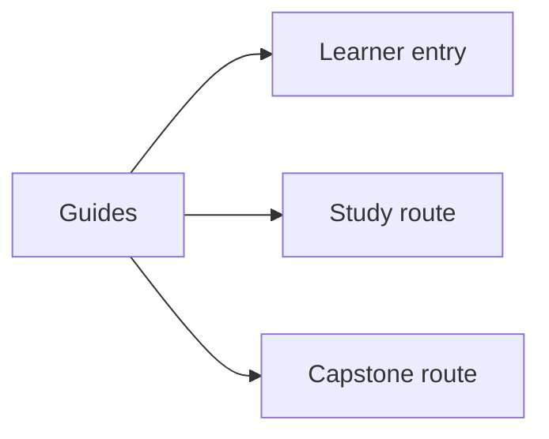
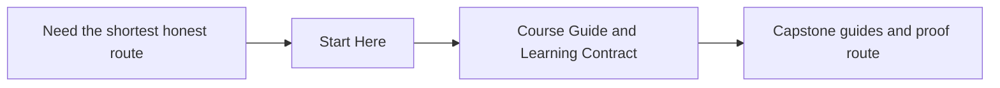

# Guides

<!-- page-maps:start -->
## Page Maps

<!-- page-maps:end -->

Use this section when you need route guidance rather than one module chapter. These
pages keep the reading order, practice rhythm, and capstone bridge explicit so the
module tree can stay focused on long-lived content.

## Pages in this section

- [Start Here](start-here.md) for the shortest honest entry path
- [Course Guide](course-guide.md) and [Learning Contract](learning-contract.md) for the study route
- [Module Dependency Map](module-dependency-map.md) and [Practice Map](practice-map.md) for pacing and review
- [Command Guide](command-guide.md) for the executable route
- [Capstone](capstone.md), [Capstone Map](capstone-map.md), and [Capstone File Guide](capstone-file-guide.md) for the capstone reading path
