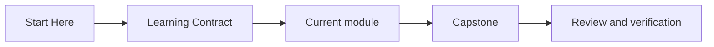
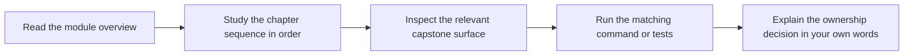

# Learning Contract

<!-- page-maps:start -->
## Page Maps

<!-- page-maps:end -->

This course asks for deliberate reading. The chapters are designed to improve design
judgment, not only recall. That only works if you keep the prose, code, and verification
surface tied together.

## Commitments the course makes to you

- the modules build from simple semantic questions to harder system questions
- the capstone gives one stable domain so abstractions stay grounded
- the prose tries to name trade-offs and failure modes directly instead of hiding them

## Commitments the learner should make back

- read module overviews before diving into leaf pages
- do not skip the refactor and checkpoint chapters
- keep asking which object owns the current invariant
- inspect code and tests when the prose makes a design claim
- revisit earlier modules when a later topic feels arbitrary
- use the capstone as a design proof, not only as an implementation example

## Reading modes

Use one of these modes deliberately instead of blending them together:

- foundation mode: read the overview, chapter sequence, and checkpoint pages in order when the topic is still new
- diagnosis mode: start from one design pressure or ownership question, then use the guide maps to find the narrowest module and capstone surface
- review mode: inspect the capstone guide, package boundary, and proof route first when you are auditing an existing design rather than learning the topic for the first time

If you switch modes, name it explicitly. The course feels clumsy when a learner tries to
review architecture with foundation-level gaps still unresolved.

## What progress looks like

Progress in this course is not "I have seen this pattern before." Progress is:

- you can reject an unnecessary class with confidence
- you can justify why a rule belongs in one object instead of another
- you can explain why a projection is useful but not authoritative
- you can predict where a feature change should land before editing code

## What failure looks like

- treating diagrams as decoration instead of decision maps
- treating the capstone as a sample app instead of a design proof
- reading advanced modules as isolated techniques without the earlier ownership model

## How to recover when a module feels dense

1. Return to the module overview.
2. Reduce the question to one ownership decision.
3. Inspect the corresponding capstone surface.
4. Re-run the executable proof and compare the result with the prose claim.

## Common self-defeating habits

- reading three modules ahead without checking whether the current ownership claim is settled
- using a proof command to escape a confusing chapter instead of clarifying the question first
- copying the capstone structure into memory without naming what each boundary protects
- treating later governance modules as if they can repair unclear object semantics from the early modules

## Recovery route when progress turns fuzzy

1. Return to the current module overview and checkpoint page.
2. Write one sentence beginning with `This object owns...`.
3. Open one capstone file that should make that sentence concrete.
4. Run the smallest route that can confirm or disprove the sentence.
5. Continue only after the sentence survives inspection.

## Minimum honest route

If time is tight, do this instead of random skipping:

1. Read the current module overview.
2. Read only the chapter sequence that supports that overview.
3. Inspect one matching capstone file.
4. Run one matching proof command.
5. Write one sentence beginning with: `This object owns...`
