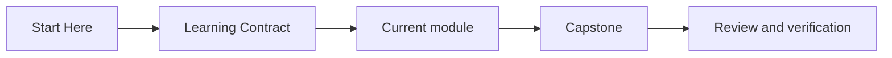
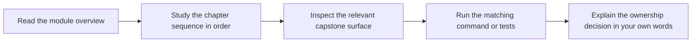

# Learning Contract

<!-- page-maps:start -->
## Page Maps

<!-- page-maps:end -->

This course asks for deliberate reading. The chapters are designed to improve design
judgment, not only recall. That only works if you keep the prose, code, and verification
surface tied together.

## Commitments the course makes to you

- the modules build from simple semantic questions to harder system questions
- the capstone gives one stable domain so abstractions stay grounded
- the prose tries to name trade-offs and failure modes directly instead of hiding them

## Commitments the learner should make back

- read module overviews before diving into leaf pages
- do not skip the refactor and checkpoint chapters
- keep asking which object owns the current invariant
- inspect code and tests when the prose makes a design claim
- revisit earlier modules when a later topic feels arbitrary

## What progress looks like

Progress in this course is not "I have seen this pattern before." Progress is:

- you can reject an unnecessary class with confidence
- you can justify why a rule belongs in one object instead of another
- you can explain why a projection is useful but not authoritative
- you can predict where a feature change should land before editing code

## What failure looks like

- treating diagrams as decoration instead of decision maps
- treating the capstone as a sample app instead of a design proof
- reading advanced modules as isolated techniques without the earlier ownership model

## How to recover when a module feels dense

1. Return to the module overview.
2. Reduce the question to one ownership decision.
3. Inspect the corresponding capstone surface.
4. Re-run the executable proof and compare the result with the prose claim.
