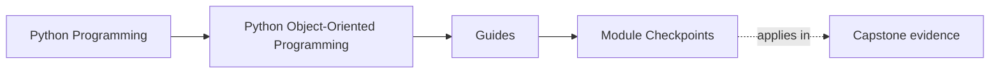
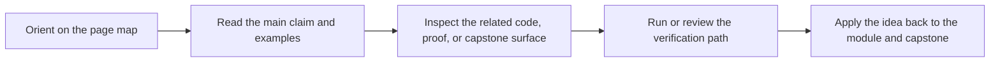

# Module Checkpoints

<!-- page-maps:start -->
## Page Maps

<!-- page-maps:end -->

Read the first diagram as a timing map: this guide is for a named pressure, not for wandering the whole course-book. Read the second diagram as the guide loop: arrive with a concrete question, use only the matching sections, then leave with one smaller and more honest next move.

Use this page at the end of each module. A strong course needs a clear exit bar, not
just more reading. These checkpoints are the smallest honest claims you should be able
to make before moving deeper into the course.

## Checkpoints by module

### Module 01: Object Semantics and the Python Data Model

- You can explain when identity matters more than value equality.
- You can describe why aliasing or mutable hashing creates non-local bugs.
- You can justify whether a type should expose data-model hooks or stay opaque.
- Prove it by inspecting `model.py` and `tests/test_policy_lifecycle.py`.

### Module 02: Design Roles, Interfaces, and Layering

- You can place behavior in values, entities, services, policies, or adapters with reasons.
- You can explain why composition or protocols are better than inheritance in a given case.
- You can sketch a composition root without letting wiring logic leak into the domain.
- Prove it by comparing `application.py`, `model.py`, and `ARCHITECTURE.md`.

### Module 03: State, Validation, and Typestate

- You can make illegal states hard to construct.
- You can describe which transitions are allowed and who guards them.
- You can explain when dataclasses, descriptors, or explicit factories fit the state model.
- Prove it by checking lifecycle tests and the saved inspection bundle from `make inspect`.

### Module 04: Aggregates, Events, and Collaboration Boundaries

- You can name the aggregate root and defend why it owns the invariant.
- You can separate authoritative objects from projections or debug views.
- You can explain what an event means without pretending every system needs event sourcing.
- Prove it by reviewing `ARCHITECTURE.md`, `read_models.py`, and the `verify-report` bundle.

### Module 05: Resources, Failures, and Safe Evolution

- You can name who owns cleanup, retries, and failure translation.
- You can describe which errors are part of the public contract and which stay internal.
- You can extend behavior without bypassing invariants or widening the public surface casually.
- Prove it by inspecting `runtime.py`, `repository.py`, and `tests/test_unit_of_work.py`.

### Module 06: Persistence, Serialization, and Schema Evolution

- You can explain how a repository rehydrates aggregates without flattening the domain.
- You can separate storage records from domain objects and query models.
- You can describe how old stored data survives schema or codec changes.
- Prove it by inspecting repository boundaries and the saved verification bundle before adding storage tooling.

### Module 07: Time, Scheduling, and Concurrency Boundaries

- You can say where time enters the model and why that boundary is explicit.
- You can explain which object owns mutation when threads, queues, or tasks appear.
- You can show where sync and async code meet without leaking event-loop assumptions inward.
- Prove it by checking runtime coordination tests and explaining why the aggregate stays synchronous today.

### Module 08: Testing, Contracts, and Verification Depth

- You can choose behavior tests, stateful tests, contract tests, or property tests deliberately.
- You can explain what confidence each proof layer buys and what it does not.
- You can design test fixtures that clarify ownership instead of hiding it.
- Prove it by mapping one design claim to one test file and one saved review bundle.

### Module 09: Public APIs, Extension Seams, and Governance

- You can name the stable public surface and the internal surface.
- You can explain what extension points are allowed and what must remain closed.
- You can describe how examples, docs, and compatibility suites defend the public contract.
- Prove it by reviewing entry surfaces plus `EXTENSION_GUIDE.md`.

### Module 10: Performance, Observability, and Security Review

- You can identify hot paths without changing semantics prematurely.
- You can explain which telemetry signals help review object boundaries in production.
- You can describe where serialization, secrets, and public inputs cross trust boundaries.
- Prove it by using the full proof route and then naming which boundary would be riskiest to blur under production pressure.

## How to use these checkpoints

- If you cannot explain the checkpoint in plain language, re-read the module overview and the module refactor chapter.
- If the checkpoint sounds true only in prose, use the named capstone surface and test or bundle route to force a concrete example.
- If a later module feels unclear, come back here and find the first checkpoint that is still fuzzy.

These checkpoints turn the course from “many advanced pages” into a sequence of earned
design abilities.
