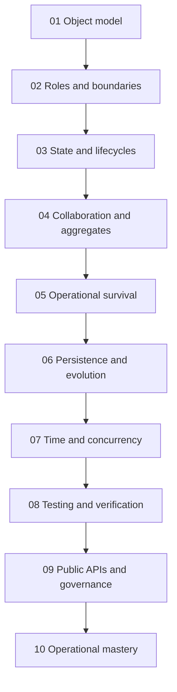
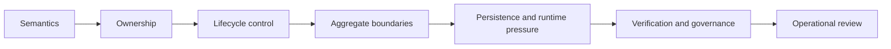

# Module Dependency Map

<!-- page-maps:start -->
## Page Maps

<!-- page-maps:end -->

This map exists to prevent a common failure mode: reading an advanced chapter without
the earlier concept that gives it meaning.

## What depends on what

- Module 01 is the semantic floor. Nothing later makes sense without it.
- Module 02 depends on Module 01 because object roles only matter after object semantics are clear.
- Module 03 depends on Modules 01 and 02 because lifecycle and typestate need stable ownership.
- Module 04 depends on Modules 01 to 03 because collaboration only works if single-object contracts are already explicit.
- Modules 05 to 07 depend on Module 04 because persistence and runtime pressure should preserve the earlier domain boundaries.
- Modules 08 to 10 depend on all earlier modules because verification, API governance, and operational mastery are audits of the whole design.

## How to use this map

- If a module feels abstract, move one step left and review its prerequisite.
- If a module feels repetitive, ask which new pressure it is adding to the same design.
- If the capstone feels confusing, match the confusion to the earliest module that explains that boundary.

## Honest interpretation

The course is not linear because learning should be rigid. It is linear because later
trade-offs become cheap slogans when the earlier ownership model is missing.
