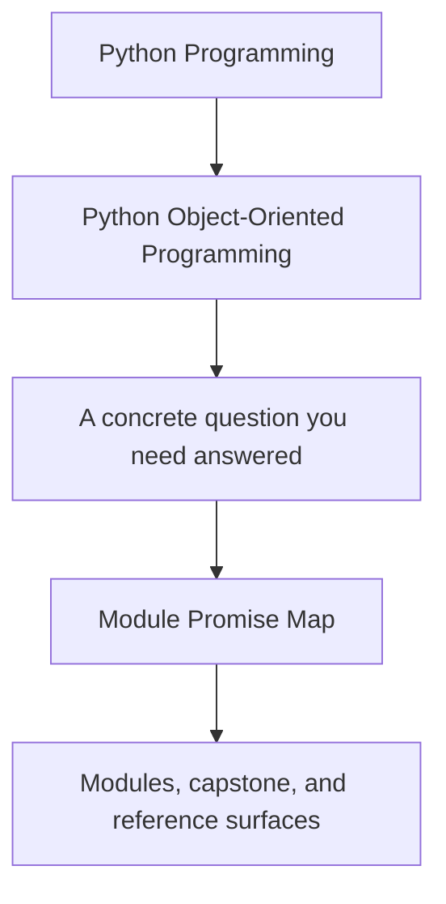
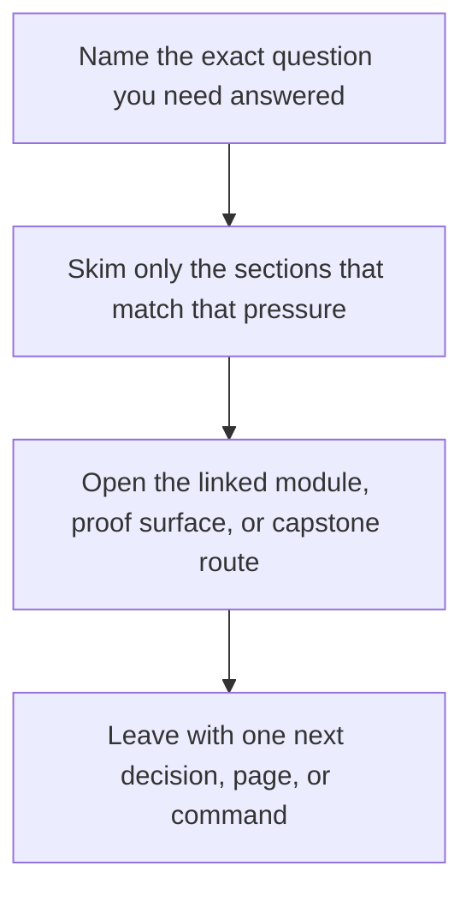

# Module Promise Map

<!-- page-maps:start -->
## Guide Fit

<!-- page-maps:end -->

Read the first diagram as a timing map: this guide is for a named pressure, not for wandering the whole course-book. Read the second diagram as the guide loop: arrive with a concrete question, use only the matching sections, then leave with one smaller and more honest next move.

Use this page when the table of contents feels wide and you want the exact promise of
each module in one place. A serious course should make clear what each module is for,
what it does not settle yet, and what design pressure it prepares you to handle next.

## The ten-module promise spine

| Module | Main promise | Not promised yet | Capstone surface to inspect | Prepares you for |
| --- | --- | --- | --- | --- |
| 01 Object Model | you can explain identity, equality, mutation, aliasing, and data-model hooks as contracts | architecture and collaboration boundaries | value objects and lifecycle rules in `model.py` | role assignment and layering |
| 02 Design and Layering | you can place behavior in values, entities, services, policies, adapters, and protocols deliberately | multi-object consistency and persistence | `application.py`, `model.py`, and boundary splits in `ARCHITECTURE.md` | state transitions and lifecycle rules |
| 03 State and Typestate | you can make illegal states and transitions harder to construct | cross-object coordination and event boundaries | lifecycle-oriented tests and validation boundaries in `model.py` | aggregates and collaboration |
| 04 Aggregates and Collaboration | you can centralize invariants and coordinate object collaboration without tangling ownership | storage, schema change, and runtime pressure | aggregate events, projections, and `ARCHITECTURE.md` | survivability and persistence |
| 05 Resources and Evolution | you can keep cleanup, retries, errors, and compatibility attached to clear owners | storage mapping and cross-process state | `runtime.py`, `repository.py`, and unit-of-work tests | repository and schema boundaries |
| 06 Persistence and Schema Evolution | you can persist aggregates without flattening away domain meaning | concurrency scheduling and async runtime design | `repository.py`, rehydration boundaries, and verification bundles | time and runtime pressure |
| 07 Time and Concurrency | you can keep clocks, queues, threads, and async boundaries from corrupting ownership | confidence strategy and public governance | runtime coordination plus tests that prove orchestration stays outside the domain | tests and public surfaces |
| 08 Testing and Verification | you can design proof routes that match stateful and contract-heavy object systems | extension governance and third-party reuse | `tests/`, `verify-report`, and the saved review bundles | public APIs and safe customization |
| 09 Public APIs and Extension Governance | you can expose a stable public surface without letting extension points dissolve the model | operational measurement and hardening | entry surfaces, guides, and extension seams | operational review |
| 10 Performance, Observability, and Security | you can review an object system under hot-path, telemetry, trust, and operational pressure | no later module; this is the integrated review pass | the full review bundle, proof route, and architecture review surfaces | capstone mastery and long-term stewardship |

## The three arcs inside the course

### Semantics arc

Modules 01 to 03 answer:

- what does an object mean?
- what role should it play?
- what states is it allowed to inhabit?

If these are weak, the rest of the course feels like architecture theater.

### Systems arc

Modules 04 to 07 answer:

- how do multiple objects preserve one coherent story?
- how do resources, persistence, time, and concurrency change ownership rules?

If these are weak, the system survives only while feature pressure is low.

### Trust arc

Modules 08 to 10 answer:

- what proof should exist?
- what is actually public?
- what breaks under load, visibility, or hostile inputs?

If these are weak, the system may look elegant but still fail under real use.

## How to use this map well

- Read the module promise before reading the module overview.
- Use “not promised yet” to avoid expecting later modules too early.
- Use “capstone surface to inspect” to keep the module promise tied to one executable place in the repository.
- Use “prepares you for” to understand why the reading order matters.

The promise map keeps the course from feeling like a pile of advanced topics. It makes
the book read like one argument about ownership, survivability, and trust.
