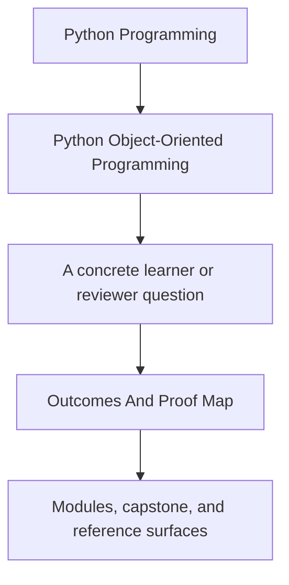
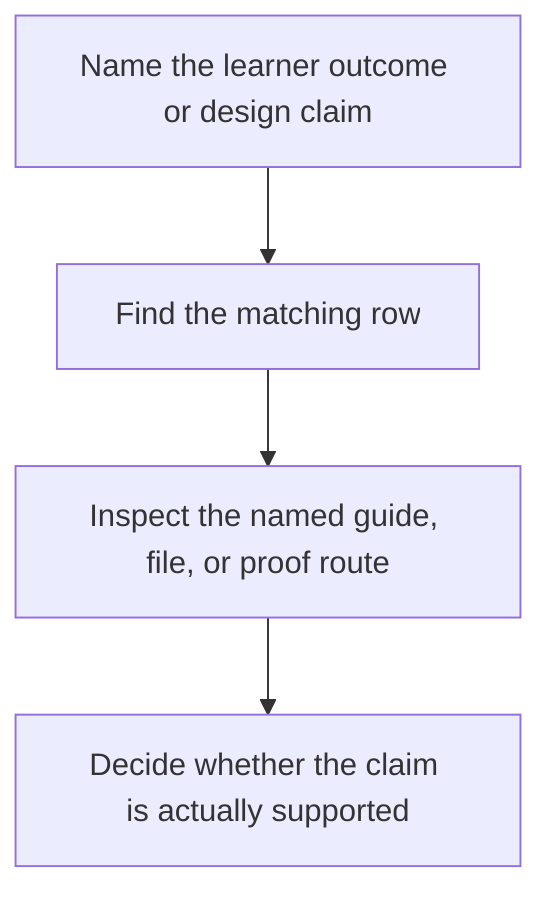

# Outcomes And Proof Map

<!-- page-maps:start -->
## Guide Fit

<!-- page-maps:end -->

Use this page when you want the course promises tied directly to evidence instead of only
to module titles. The course is easier to trust when every learner outcome points to a
stable proof route in the capstone or the review shelf.

| If the intended outcome is... | Read first | Inspect next | Best proof route |
| --- | --- | --- | --- |
| explain what an object means instead of treating it like a bag of fields | Module 01 and [Module Promise Map](module-promise-map.md) | `src/service_monitoring/model.py`, lifecycle tests | `make inspect` |
| assign behavior to values, entities, policies, services, and adapters honestly | Module 02 and [Pressure Routes](pressure-routes.md) | `model.py`, `application.py`, `policies.py` | `make tour` |
| make illegal states and lifecycle errors harder to construct | Module 03 and [Module Checkpoints](module-checkpoints.md) | lifecycle methods and validation paths in `model.py` | `make inspect` |
| keep cross-object invariants inside the right aggregate boundary | Module 04 and [Capstone Architecture Guide](../capstone/capstone-architecture-guide.md) | aggregate events, projections, and event flow | `make verify-report` |
| place retries, cleanup, recovery, and orchestration outside domain ownership | Module 05 and [Pressure Routes](pressure-routes.md) | `runtime.py`, unit-of-work surfaces, error handling tests | `make tour` |
| add persistence without flattening the model into storage shapes | Module 06 and [Capstone File Guide](../capstone/capstone-file-guide.md) | repository and projection boundaries | `make verify-report` |
| add clocks, queues, threads, or async pressure without corrupting ownership | Module 07 and [Proof Ladder](proof-ladder.md) | runtime coordination surfaces and tests | `make verify-report` |
| judge whether tests actually prove the intended contracts | Module 08 and [Capstone Proof Guide](../capstone/capstone-proof-guide.md) | `tests/`, saved proof bundles, inspection outputs | `make confirm` |
| publish safe public APIs and extension seams | Module 09 and [Capstone Review Checklist](../capstone/capstone-review-checklist.md) | public facade, source guide, extension surfaces | `make proof` |
| review operational trust, observability, and hardening without losing the design | Module 10 and [Proof Ladder](proof-ladder.md) | full bundle set, architecture, public review outputs | `make proof` |

## How to use the map honestly

1. Name the learner outcome or design claim in one sentence.
2. Start with the smallest guide or module that owns that claim.
3. Inspect the named capstone surface before escalating to the strongest command.
4. Run only the proof route that produces the evidence you actually need.

## Best companion pages

- `module-promise-map.md`
- `module-checkpoints.md`
- `proof-ladder.md`
- `capstone/capstone-map.md`
